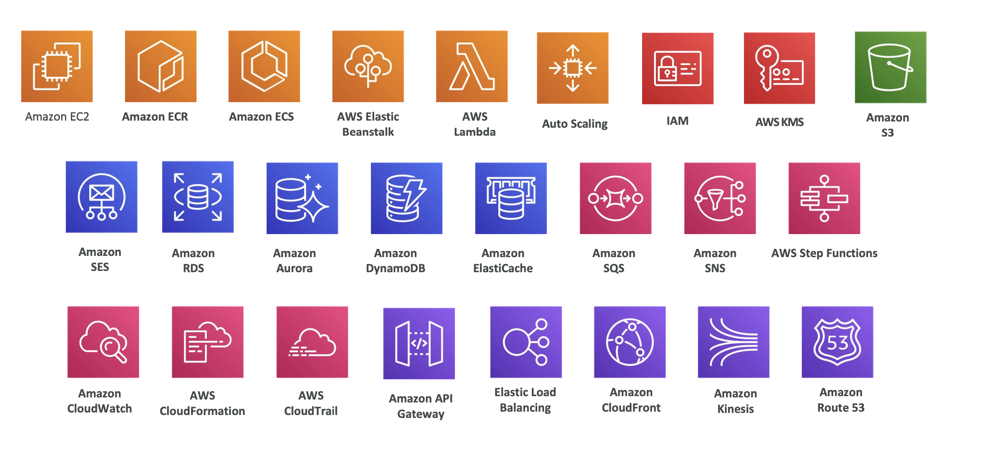
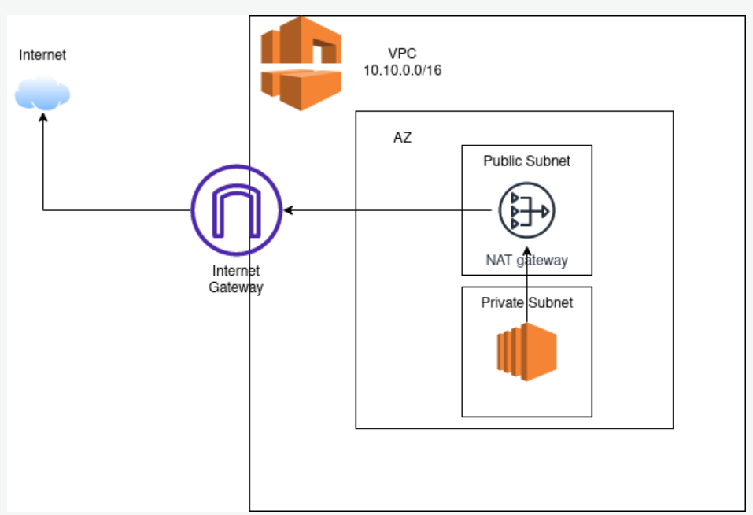
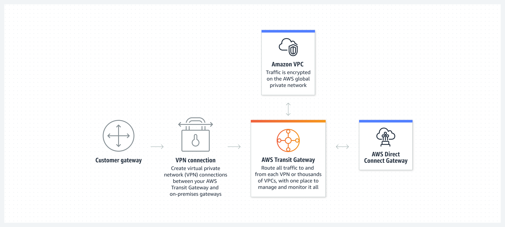
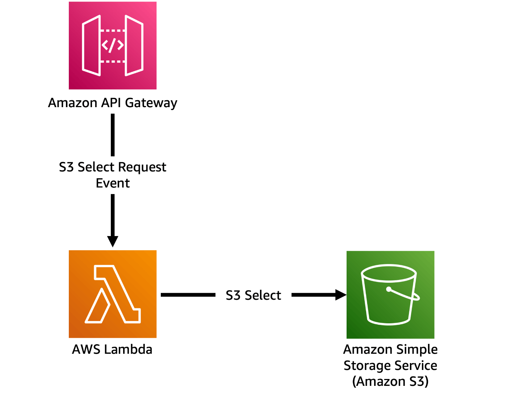
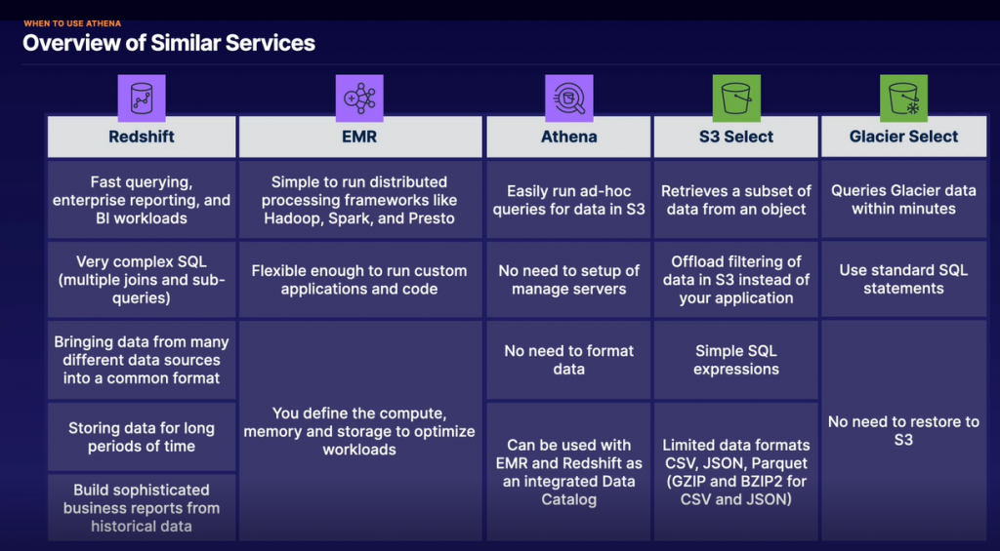
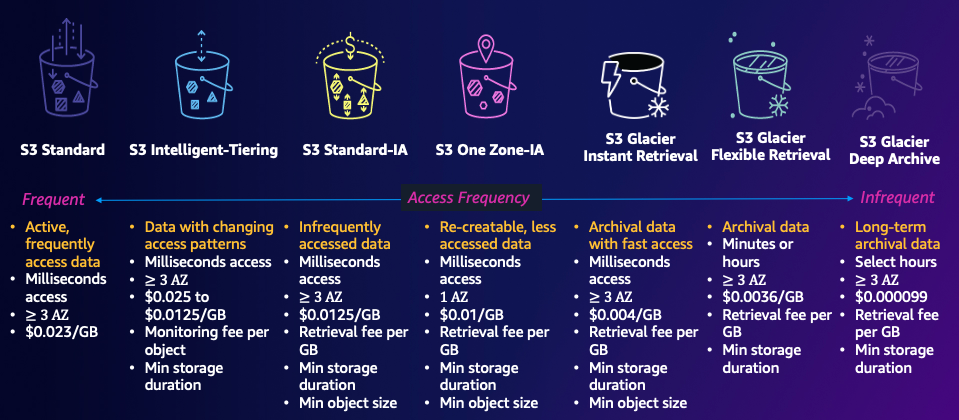
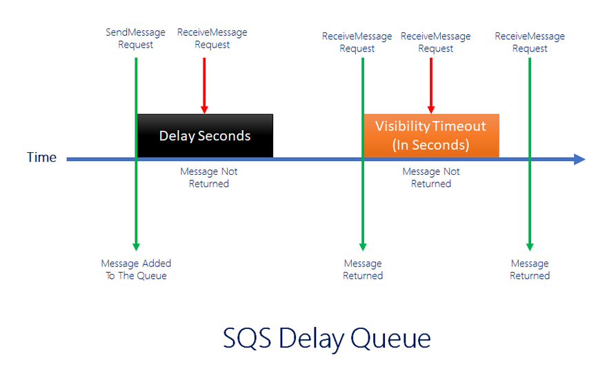

# EC2
- user script
- ip
  - private ip
  - public ip
  - elastic ip
- security group
- ec2 connect
- image
  - for computing/ram/...
- EBS: elastic block storage
- ASG
- ec2 reserved intances min time to buy

# ECR
- registry
- public
- private

# ECS
- 2 launch type: ec2 and fargate
- cluster
- service
- task, task definition
- availibity, multi region

# AWS Elastic BeanStack
- what is it

# Auto Scaling
- method
- HA
- IP

# Lambda
- serverless
- 25 minutes
- service can connect

# IAM
- user
- group
- policy

# AWS KMS
- KMS, client, aws managed
- rotate

# S3
- object
- key
- bucket
- static host
- presigned url
- IAM, policy, 
- analysis
- log
- security
- object lock
- storage classes -> choose plan
- s3 transfer acceleration
- s3 can send events to wwhere?
- Enable MFA deletion -> need to enable s3 versioning
- Requester pays feature

# SES
- simple email service

# RDS
- database support: mysql, postgres
- multi region
- read write replica
- cluster
- what is RDS standby database

# Aurora
- serverless
- HA
- settings
- replica
- plan: dedicated...

# DynamoDB
- serverless
- big table
- DAX cache
- when to use

# Elastic Cache
- redis, ehcache
- ....

# SQS
- simple queue
- ordered or not
- max message, max partition
- global or not
- fan out arch

# SNS
- noti
- channel: mail, app, ...
- max number of message
- price
- ...

# Step Function
- ...

# CloudWatch
- logs
- sources?
- price

# Cloud Formation
- ..

# Cloud Trail
- ..

# API Gateway
- ...

# Load Balancing
- types: app, elastic, network
- create, info
- price
- algorithm

# CloudFront
- cache time
- static/dynamic
- price
- geography
- clear cache
- source

# Kinesis
- contains 3 part: stream, ...
- use case

# Route53
- why 53
- domain, cname, ip, ....
- 1 ip -> multi ip
- arch
  

# Security and Encryption
- Firewall
- Network
- organization
- 

# Network VPC
- direct connect
- vpn

# Disaster Recovery

# Machine Learning
- Marcie
- tts
- stt

# Monitoring and audit
- 
# Storage extra
- Snow family
- data migration
- Amazon FSx
- Data sync
- Storage gateway

# Databases

# Data Analytics

# Disaster Management
- RTO, RPO

# VPC
- when create -> 5 IPs can not used (firt 4 + last 1)
- vpc gateway 

# EMR

# Redshift
-> data warehouse 

# QuickSight

# Question
- Compare NAT GAteway, Nat instance, Internet Gateway, Ingress for ipv6
- Snowcone/snowball sizes
- AWS global accelarator vs Cloud Front
  - Global Accelerator: 
    - anycastIP  -> go throught AWS network instead of through internet nodes
    - uses Edge Locations to find an optimal pathway to the nearest regional endpoint. -> when > 1 regions
    - is best used for both HTTP and non-HTTP protocols such as TCP and UDP
    - 
  - CloudFront: 
    - cache content static and dynamic
    - uses Edge Locations to cache content
    - designed to handle HTTP protocol
- Glue vs QuickSight
  - Glue: ETL, can bookmark old-data
  - QuickSight: visualization, Dashboard
- Team limit access -> use users and groups
- review configuration -> use AWS Config
- no account -> can send link to email
- UDP, other Protocol (ex: VoIP) -> NLB instead of ALB
- NACL vs SG
  - NACL
    - Network access control list
    - for subnet
    - stateless (incoming and outgoing are separated)
    - order by priority
    - support both allow and deny rules
    - 1 subnet -> only 1 NACL
  - SG:
    - security group
    - for instance
    - stateful: any change applied to incoming rule -> auto applied to outgoing rule (ex: allow incoming port 80 -> auto allow outgoing port 80)
    - default: denial of all rules, but can use allow only
    - no order, apply all
    - 1 instance can have more than 1 SG

- snapshot -> no running cost
- SaaS:
  - App Flow
- EC2 -> S3 or Dynamo -> should use gateway VPC endpoint to reduce regional transfer cost
- NAT Gateway
  - A NAT gateway is a Network Address Translation (NAT) service. You can use a NAT gateway so that instances in a private subnet can connect to services outside your VPC but external services cannot initiate a connection with those instances.
  - 2 type
    - public: need elastic ip , can access internet
    - private: to other vpc, or on-premises, can not associate with elasticIP
- IGW, NATGW, NAT instance
  - IGW: internet GW, **each VPC**
  - NAT instance: mannually run NAT on EC2 for go to internet
  - NAT GW: for **each AZ**, of AWS
  -   
  - internet routing
    - private ec2 (private subnet) -> NATGW (public subnet) ---publicIP---> IGW -- return
- Transit GW:
  - AWS Transit Gateway connects your Amazon Virtual Private Clouds (VPCs) and on-premises networks through a central hub. This connection simplifies your network and puts an end to complex peering relationships. Transit Gateway acts as a highly scalable cloud router—each new connection is made only once.
  - 
- from op-premise to AWS (limited network bandwidth) -> use Direct Connect
- prevent s3 accidential deletion -> MFA delete -> need to enable versioning
- Macie
  - data security service, sensitive data
- GuardDuty
  - Amazon GuardDuty is a **security monitoring service** that analyzes and processes certain types of AWS logs, such as AWS CloudTrail data event logs for Amazon S3 and CloudTrail management event logs. It uses threat intelligence feeds, such as lists of malicious IP addresses and domains, and machine learning to identify unexpected and potentially unauthorized and malicious activity within your AWS environment.
- S3
  - random access -> use Intelligent
  - S3 Select, Glacier Select (within minutes -> slow) -> use `select` like sql query -> faster and cheaper
  -  
- EMR
  - distributed processing like hadoop spark
-    
- need to run command many ec2 instances -> Amazon System Manager Run
- S3
  -   
- SQS visibility time out -> avoid consume from many consumer
  -   
- Route 53
  - geoproximity: region -> on of many IPs
  -  

