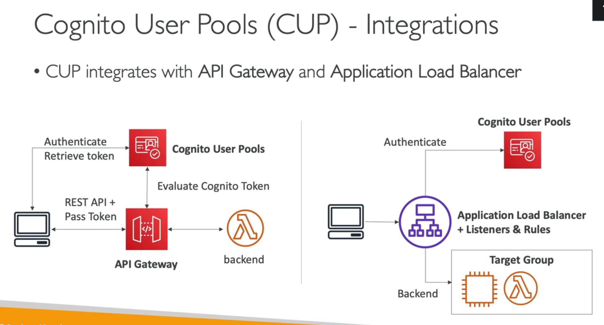
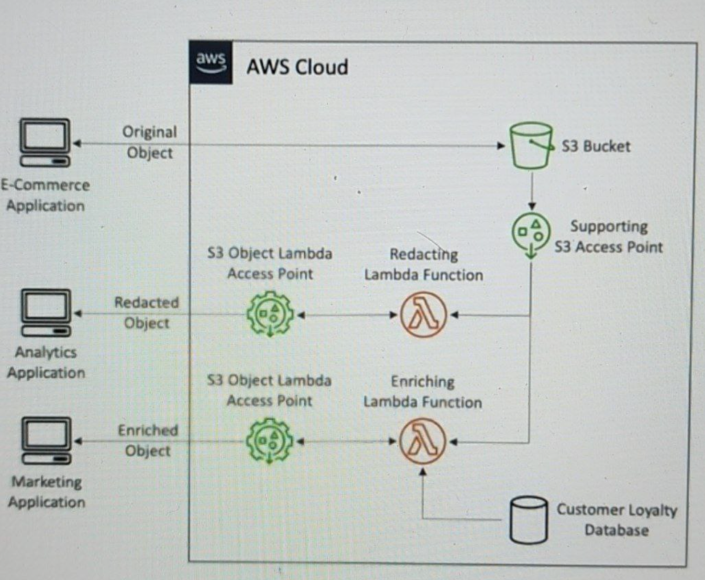
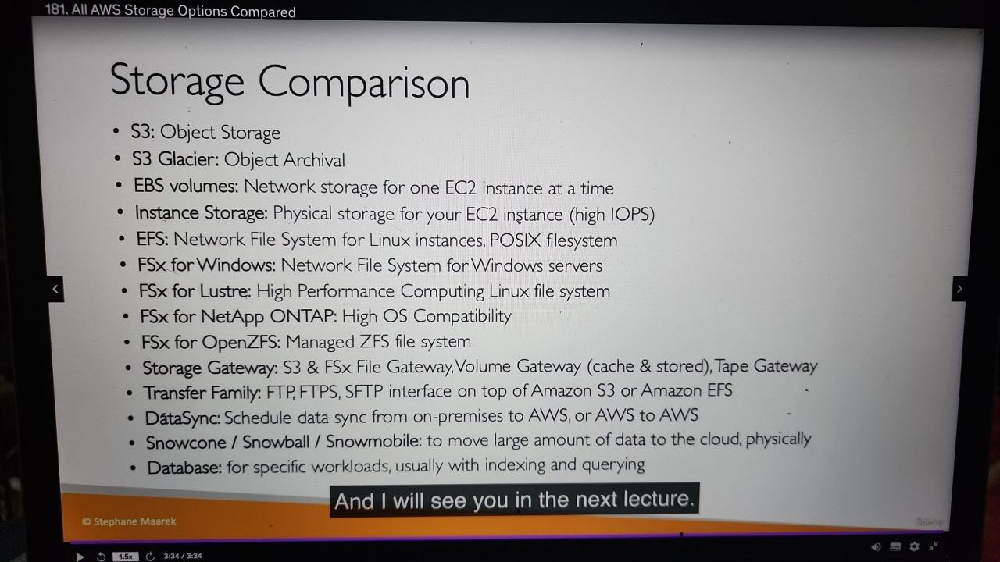
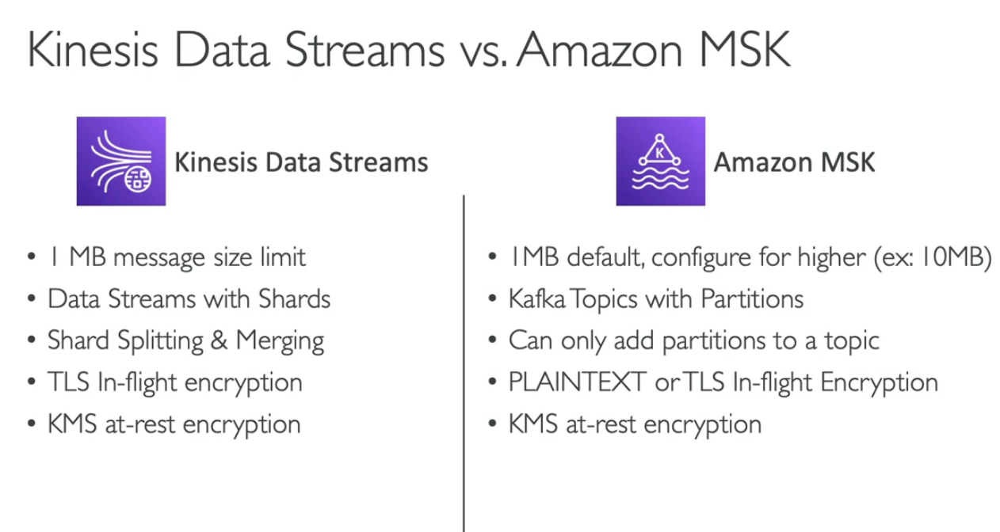

# EC2
- user script
- ip
  - private ip
  - public ip
  - elastic ip
- security group
- ec2 connect
- image
  - for computing/ram/...
- EBS: elastic block storage
- ASG
- ec2 reserved intances min time to buy

# ECR
- registry
- public
- private

# ECS
- 2 launch type: ec2 and fargate
- cluster
- service
- task, task definition
- availibity, multi region

# AWS Elastic BeanStack
- what is it

# Auto Scaling
- method
- HA
- IP

# Lambda
- serverless
- max: 15 minutes
- service can connect
  - DynamoDB
  - 
- Lambda@Edge
  - feature of cloudfront -> run code closer to users
- AWS Step Function: build Serverless workflow
  - using AWS service
  - support human approval
- Invoking
  - DynamoDB:
    - 2 types:
      - provisioned: must specify RCU and WRU (read and write capacity unit) 
      - on-demand
    - DAX: DynamoDB Accelerator -> cache
    - DynamoDB Stream:
      - capture a time-ordered sequence
      - -> send to AWS Lambda
      - must enable if want to create replicas
    - max size 1 item: 400KB
- API Gateway
- Cognito
  - User Pools 
    - -> sign in, integrate with API gW, ALB
    - simple log in, password reset, email/phone verification, MFA
    - users from FB, GG, SAML
    - 
  - Identity Pools -> provide AWS credentials for users to access AWS
- 
# IAM
- user
- group
- policy

# AWS KMS
- KMS, client, aws managed
- rotate

# Databases
## S3
- object
- key
- bucket
- static host
- presigned url
- IAM, policy, 
- analysis
- log
- security
- object lock
- storage classes -> choose plan
- s3 transfer acceleration
- s3 can send events to wwhere?
- Enable MFA deletion -> need to enable s3 versioning
- Requester pays feature -> when share
- Noti: 2 options
  - 1. s3 -> eventBridge -> 18 services
  - 2. Config noti s3 -> Lambda, SNS, SQS
- Performance
  - Per prefix
  - Optimize:
    - Multipart upload
    - transfer acceleration: edge location -> des s3
    - Buye-Range Fetches -> divide many parts -> speed up download
- S3 Select, Glacier Select -> use query, faster 400%, cheaper 80%
- S3 batch
  - Bulk operations: Modify meta
    - copy between buckets
    - encrypt/decrypt obj
    - restore objects grom S3 Glacier
    - invoke lambda function
  - track progress, send noti, gen report
  - S3 Inventory to get obj list, S3 Select to filter
- s3 pre-signed URL
- S3- Glacier Vault Lock
  - WORM
  - Lock policy for future edits -> can no longer be changed and deleted
  - Helpful for compliance and data retention
- S3 - Object Lock
  - must enable versioning
  - WORM
  - Retention mode
    - compliance: no change, no overwritten, no shorten period
    - governance: most users can not overwrite, some user can change retention, delete obj
  - Legal Hold
    -  s3:PutObjectLegalHold
    -  protect the object **indefinitely**, independent from retention period
-  S3 Access Point
   -  DNS + policy to limit
   -  IAM user/group
-  S3 Object Lambda
   -  Use lambda change obj before retrieve
   -  For: redact PII, convert format, Resizing image
   -  Collab with S3 access point
   -    
- Encryption
  - SSE-S3
  - SSE-KMS
  - SSE-C: admin provide keys
  - client-side

## RDS
- database support: mysql, postgres, oracle, SQL Server, Maria, Custom
- multi AZ
- read write replica
- cluster
- what is RDS standby database
  - standby ~ near -> nearest read replica
- security by IAM, SG, KMS, SSL
- support Secret Manager
- deployment options:
  - Single DB, multiAZ db, MultiAZ DB Cluster

## Aurora
- serverless
- HA
- settings
- replica
- plan: dedicated...

## DynamoDB
- serverless
- big table
- DAX cache
- when to use
- active-active setup: read and write at any replicas (only for global table)
- PITR: point in time recovery - max : 35 days
- millisecond latency
- can replace ElasticCache for store session, can use TTL feature
- MultiAZ by default, Decouple Read and Write, 
- Security: IAM
- Can integrated with Lambda, Kinesis Data Stream
- can export/import to/from S3 without RCU and WCU

## Elastic Cache
- redis, Memcached
- Clustering, MultiAZ, Read replica (sharding)
- Security: IAM, SG, KMS, Redis Auth
- Point in time / backup / restore
- Usage: key-value, cache, session
- ....

## DocumentDB
- MongoDB
-  replication in 3 AZ
- grows in increments of 10GB, upto 64TB
- auto scale - milions req/s
- json

## Neptune
- graph
- replication: in 3 AZ, max 15 read replicas
- billions of relations
- millisecond latency
- social, wikipedia, fraud detection

## KeySpaces
- Casandra
- No SQL- distributed
- ms(s) latency
- thousands req/s
- Capacity: on-demand or provisioned mode with auto scaling
- PITR max 35 days
- encryption
- Usage: time series, IoT info

## QLDB (Quantum Ledger)
- financial transaction
- for crypto,...

## Timestream
- built in analysis
- Usage: IoT app, real-time analytics

# SES
- simple email service

# SQS
- simple queue
- ordered or not
- max message, max partition
- global or not
- fan out arch
- unlimited throughput, unlimited number of messages
- default retention: 4 days, max - 14 days
- low latency: < 10 ms
- 256KB limitation per message
- destinations: EC2, servers, Lambda
- max consumed message at a time: 10
- can order (FIFO) or not (default)
- fully managed
- can combine with ASG: queue -> cloudwatch metric (approximateNumberOfMessages) -> CloudWatch Alarm -> ASG
- Security
  - Encryption: HTTPS, KMS Keys, client-side
  - access control: IAM policies
  - SQS Access Policies: cross-account, or other services
- Message Visibility Timeout
  - message -> consumed -> invisible -> timeout -> visible again
  - if long -> if consumer crash -> re-processing take time
  - if short ( less than processing time) -> duplicate
- Long Polling
  - wait when messages occur
  - decrease the number of API calls
  - increase efficiency, and latency
  - from 1 sec -> 20 sec (20s is preferable)
  - Config WaitTimeSeconds
- FIFO
  - limit: 300 msg/s if not batching, 3000 if batching
  - removing duplicates -> exactly-once send capacity
  - queue name must be ended with '.fifo'
- Can use SQS as a buffer before write to DB
- can use to decouple between app tiers
- 

# SNS
- noti
- channel: mail, app, ...
- max number of message
- price
- ...

# Step Function
- ...

# CloudWatch
- logs
- sources?
- price

# Cloud Formation
- ..

# Cloud Trail
- ..

# API Gateway
- ...

# Load Balancing
- types: app, elastic, network
- create, info
- price
- algorithm

# CloudFront
- cache time
- static/dynamic
- price
- geography
- clear cache
- source
- Overview
  - CDN
  - 216 edge locations
  - DDOS protection, can be intergrated with Shield, WAF
- Origions
  - S3
  - Custom HTTP: ALB, EC2, S3 website, other HTTP
- Compare with S3 Cross Region Replication
  - CF: cache, global, not real-time (cache), static content everywhere
  - S3 CRR: replicate, must setup each region, update files real-time, for low latency in few regions
- CloudFront Geo Restriction
  - You can restrict who can access your distribution
    - AllowList: list of approved countries
    - BlockList: list of banned countries
- Pricing
  - 3 classes
    - All: all regions -> best performance
    - 200: most regions, excludes most expensive regions
    - 100: only cheap regions (uS, europe)
- Cache invalidation
  - all files or specific path
- unicast and anycast
  - uni: 1 server - 1ip
  - any: 1 ip for many server -> route to nearest server
- Global Accelerator
  - 2 any cast ip are created for your app
  - anycast ip send traffic to egde location
  - edge locatuon send to you aoo
  - works with elastic IP, ec2, alb, nlb, public private
  - make app global
  - DDOS protection with shield
  - TCP, UDP, MQTT, Voice over IP

# Kinesis
- contains 3 part: stream, ...
- use case

# Route53
- why 53
- domain, cname, ip, ....
- 1 ip -> multi ip
- arch
  

# Security and Encryption
- Firewall
- Network
- organization
- 

# Network VPC
- direct connect
- vpn

# Disaster Recovery

# Machine Learning
- Marcie
- tts
- stt

# Monitoring and audit
- 
# Storage extra
- Snow family
  - offline
  - data migration: snowcone, snowball, snowmobile
  - edge computin: snowcone, snowball edge
  - can NOT move directly to S3 Glacier, must combine S3 lifecycle policy

- Amazon FSx
  - fully managed
  - FSx for Lustre: 
    - file system
    - linux + cluster
    - parallel distributed, large scale computing
  - FSx for NetApp ONTAP
    - NFS, SMB, iSCSI protocol
    - point in time cloning (helpful for testing new workloads)
  - FSx for Win
    - SMB and NTFS
    - can be mounted on Linux EC2 instances
  - FSx for OpenZFS
    - point in time cloning
- Storage gateway
  - hybrid cloud: cloud + on-premises
  - use cases: disaster and recovery, backup and restore, on-premises cache, low-latency files access
  - types:
    - S3 File GW
    - FSx File GW
    - Volume GW
    - Tape GW
- AWS Transfer Family
  - fully managed
  - FTP protocol 
  - for S3 and EFS
  - intergrate with authen (microsoft active dir, lDAP, ockte, Cognito, custom)
  - Usage: share files, publuc datasets, CRM, ERP
  - need IAM role to access S3, EFS
- Data sync
  - sync on-premises <-> cloud, or between AWS services
  - if on-premises -> need agent
  - S3, EFS, FSx
- Summary
  -   

# Data Analytics
## Athena
- Query from S3 using SQL
- ad-hoc
- CSV, JSON, ORC, Avro, Parquet
- 5$ per TB
- combine with QuickSight to reporting, dashboard

## Redshift
- based on postgreSQL, but for OLAP
- analytics and data warehousing
- columnar storage (not row based)
- integrated with QuickSight, Tableau
- snapshot to create new cluster
- can copy snapshot to other Region
- datasource
  - Kinesis Data Firehose
  - S3
  - EC2: better if write by batches
- Redshift Spectrum
  - query from S3 without loading S3 bucket

## OpenSearch
- ElasticSearch
- managed cluster and Serverless cluster
- Ingestion from Kinesis Data Firehose, AWS IoT, CloudWatch logs
- Security: Cognito, IAM, KMS, TLS
- OpenSearch Dashboard -> visualization
- combine with DynamoDb: 
  - CRUD -> Dynamo -> Dynamo Stream -> Lambda -> OpenSearch
- combine with CloudWatch logs
  - CLW logs -> Subscription Filter ->
  - -> Lambda (real time) / Kinesis Data Firehose (near real-time)
  - -> OpenSearch
- combine with kinesis
  - 1, Kinesis Stream -> Lambda (realtime) -> openSearch
  - 2, kinesis Stream -> Firehose (near real-time) -> OpenSearch

## EMR
- Elastic MapReduce
- Hadoop Cluster - Big data
- hundreds of EC2
- intergrated with Spot Instances

## QuickSight
- Dashboard with machine learning
- Integrated with RDS, Aurora, Athena, RedShift, S3
- Can share dashboard with Users or Groups

## Glue
- ETL
- source: S3, RDS
- trigger: by Lambda or EventBridge
- Bookmark: prevent re-processing old data
- Streaming ETL: integrated with Kinesis Stream, Kafka, MSK

## AWS Lake Formation
- Central Data lake
- Source: S3, RDS, Aurora, On premises
- Built on top GLue for ETL
- des: Redshift, Athena, EMR

## Kinesis
- for analytics
- sources;
  - Stream: for ingesting, storing
  - Firehose: for loading from multi sources -> to S3, Redshift, OpenSearch
  - 
  - 

## MSK (Managed kafka)
- 

# Machine Learning
##

# Disaster Management
- RTO, RPO

# VPC
- when create -> 5 IPs can not used (firt 4 + last 1)
- vpc gateway 

# EMR

# Redshift
-> data warehouse 

# QuickSight

# Question
- Compare NAT GAteway, Nat instance, Internet Gateway, Ingress for ipv6
- Snowcone/snowball sizes
- AWS global accelarator vs Cloud Front
  - Global Accelerator: 
    - anycastIP  -> go throught AWS network instead of through internet nodes
    - uses Edge Locations to find an optimal pathway to the nearest regional endpoint. -> when > 1 regions
    - is best used for both HTTP and non-HTTP protocols such as TCP and UDP
    - 
  - CloudFront: 
    - cache content static and dynamic
    - uses Edge Locations to cache content
    - designed to handle HTTP protocol
- Glue vs QuickSight
  - Glue: ETL, can bookmark old-data
  - QuickSight: visualization, Dashboard
- Team limit access -> use users and groups
- review configuration -> use AWS Config
- no account -> can send link to email
- UDP, other Protocol (ex: VoIP) -> NLB instead of ALB
- NACL vs SG
  - NACL
    - Network access control list
    - for subnet
    - stateless (incoming and outgoing are separated)
    - order by priority
    - support both allow and deny rules
    - 1 subnet -> only 1 NACL
  - SG:
    - security group
    - for instance
    - stateful: any change applied to incoming rule -> auto applied to outgoing rule (ex: allow incoming port 80 -> auto allow outgoing port 80)
    - default: denial of all rules, but can use allow only
    - no order, apply all
    - 1 instance can have more than 1 SG

- snapshot -> no running cost
- SaaS:
  - App Flow
- EC2 -> S3 or Dynamo -> should use gateway VPC endpoint to reduce regional transfer cost
- NAT Gateway
  - A NAT gateway is a Network Address Translation (NAT) service. You can use a NAT gateway so that instances in a private subnet can connect to services outside your VPC but external services cannot initiate a connection with those instances.
  - 2 type
    - public: need elastic ip , can access internet
    - private: to other vpc, or on-premises, can not associate with elasticIP
- IGW, NATGW, NAT instance
  - IGW: internet GW, **each VPC**
  - NAT instance: mannually run NAT on EC2 for go to internet
  - NAT GW: for **each AZ**, of AWS
  -   
  - internet routing
    - private ec2 (private subnet) -> NATGW (public subnet) ---publicIP---> IGW -- return
- Transit GW:
  - AWS Transit Gateway connects your Amazon Virtual Private Clouds (VPCs) and on-premises networks through a central hub. This connection simplifies your network and puts an end to complex peering relationships. Transit Gateway acts as a highly scalable cloud router—each new connection is made only once.
  - 
- from op-premise to AWS (limited network bandwidth) -> use Direct Connect
- prevent s3 accidential deletion -> MFA delete -> need to enable versioning
- Macie
  - data security service, sensitive data
- GuardDuty
  - Amazon GuardDuty is a **security monitoring service** that analyzes and processes certain types of AWS logs, such as AWS CloudTrail data event logs for Amazon S3 and CloudTrail management event logs. It uses threat intelligence feeds, such as lists of malicious IP addresses and domains, and machine learning to identify unexpected and potentially unauthorized and malicious activity within your AWS environment.
- S3
  - random access -> use Intelligent
  - S3 Select, Glacier Select (within minutes -> slow) -> use `select` like sql query -> faster and cheaper
  -  
- EMR
  - distributed processing like hadoop spark
-    
- need to run command many ec2 instances -> Amazon System Manager Run
- S3
  -   
- SQS visibility time out -> avoid consume from many consumer
  -   
- Route 53
  - geoproximity: region -> on of many IPs
-  sudden spike -> use async communication: SQS queue, SNS pub/sub, Kinesis

