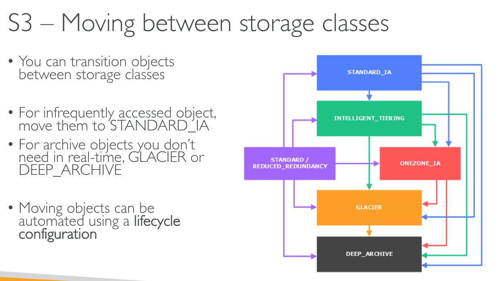
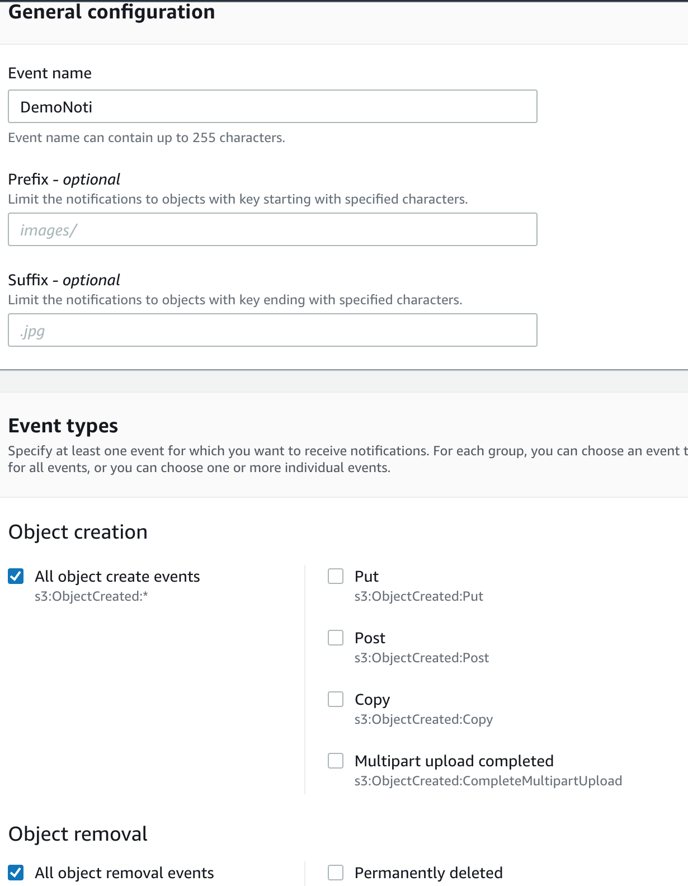
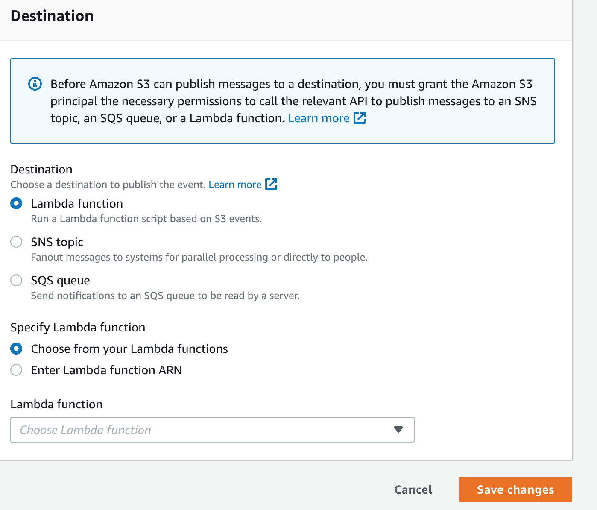

# S3 - Moving between Storage classes

- Move from high to low, higher classes can be moved to all lower classes
- Standard -> standard IA -> Intelligent tiering -> one-zona IA -> Glacier  Instant Retrieval -> Glacier Flexible Retrieval -> Glacier Deep Archive

# S3 - analytics

- help you decide when to transition objects to the right storage class
- report is updated daily

# S3 - Requester Pays

- instead of owner
- helpful when you want to share large datasets with other accounts
- the requester must be authenticated in AWS

# S3 - Notifications

- S3:ObjectCreated, S3:ObjectRemoved, S3:ObjectRestore, S3:Replication,..
- Use case: generate thumbnails of images uploaded to S3
- Option 1: Amazon EventBridge:
  - events -> S3 -> Amazon EventBridge -> Over 18 AWS services
- Option 2: create your event noti config
  - 
  - 
  - SQS: simple queue service

# S3 - Performance

- S3 auto scales to high request rates, latency 100-200ms
- At least 3500 PUT/COPY/POST/DELETE req per second per prefix
- At least 5500 GET/HEAD req per second per prefix
- (Prefix mean path (folder)) -> if you hace 4 prefixes -> can achieve 22000 req/s for GET and HEAD
- How to optimize:
  - Multi-Part upload:
    - recommend for file > 100 MB
    - must use for files > 5GB
    - big file -> divide in parts (chunks) -> parallel uploads -> S3 collect and merge -> big file
  - S3 transfer acceleration
    - upload to edge location (nearby bucket) first
    - File in USA ---fast public www--> fast upload to USA region ---fast private AWS---> S3 bucket in Vietnam
  - S3 Byte-Range Fetches
    - Parallelize GETS by requesting byte ranges
    - File -> divide to many part -> requests in parallel
    - -> speed up downloads
    - OR: retrieve only partial data . Ex: retrieve file header only
    - File -> header and many parts -> retrieve header only

# S3- Select and Glacier Select

- S3 select: 400% faster, 80% cheaper
- Ex: need to get data from csv -> S3 filter data from csv -> return

# S3- Batch

- Bulk operations:
  - Modify object metadata & properties
  - copy between buckets
  - encrypt un-encrypted objects
  - modify ACL, tags
  - restore objects from S3 glacier
  - invoke lambda function to perform custom action on each object
- a job consists of a list of objects, the action to perform and optional params
- S3 batch operations manages retries, tracks progress, sends to completion noti, generate report
- Use S3 Inventory to get object list and use S3 Select to filter your objects
