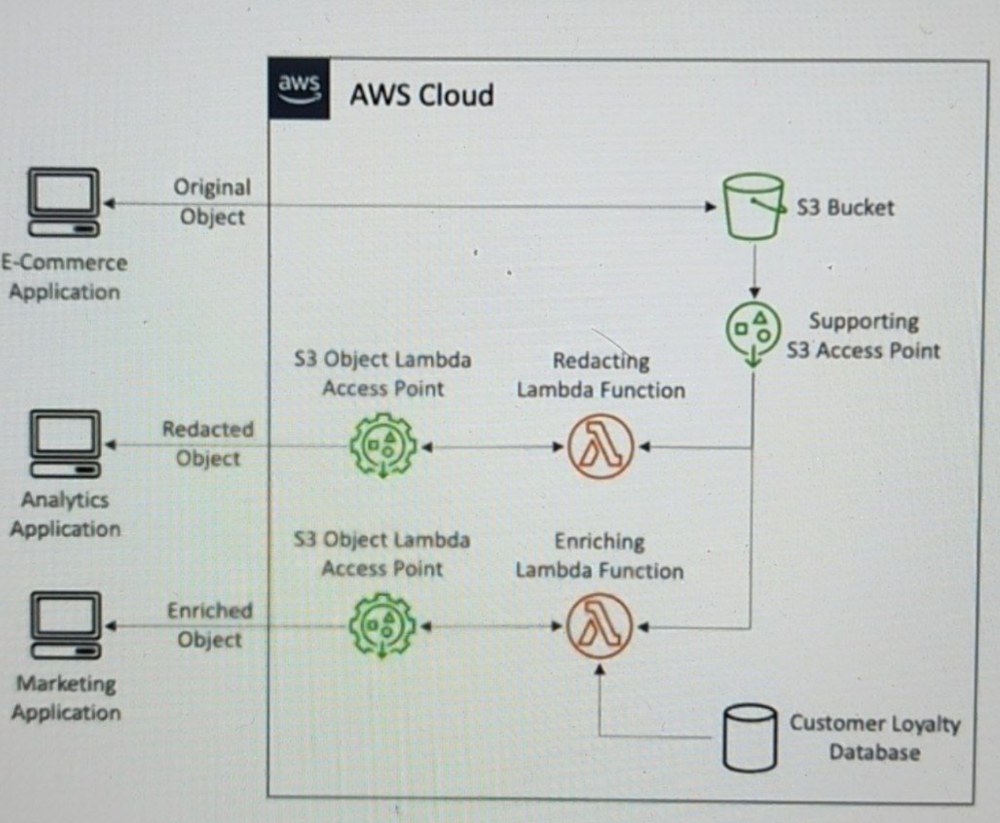

# S3 - Pre-signed URLs

- generate using S3 console, CLI, SDK
- Expiration:

  - s3 console: 1-720 min
  - CLI: default 3600s, max 168h
- Flow:

  - owner `<---gen PS url--->` S3
  - owner ---send URL---> user
  - user ---use URL---> S3
  - S3 ---return--> user
- Use case:

  - vip user download premium video from S3
  - allow temporarily a user to upload file

# S3 - Glacier Vault Lock

- Adopt with WORM model (write once read many)
- create a Vault Lock Policy
- Lock policy for future edits -> can no longer be changed and deleted
- Helpful for compliance and data retention

# S3 - Object Lock

- versioning must be enabled
- adopt a WORM model
- block an object version deletion for specified amount of time
- retention mdoe - compliance:
  - verion can NOT be overwritten
  - retention modes can NOT be changed, retention periods can NOT be shortened
- retention mode - governance
  - most users can NOT overwrite or delete object version or alter its lock settings
  - some user have special permissions to change the retention or delete the object
- Retention period: fixed period, can be extended
- Legal Hold
  - protect the object indefinitely, independent from retention period
  - can be freely placed and remvoed using the s3:PutObjectLegalHold IAM permission

# S3 - Access Points (AP)

- each AP get its own DNS and policy to limit who can access it
- IAM user/group ----AP----> S3
- one policy for each AP

# S3 - Object Lambda

- Use AWS Lambda Functions to change the object before it is retrieved by the caller application
- Ony one S3 bucket is needed, on top of which we create S3 Access Point and S3 Object Lambda Acess Point
- Use case:

  - Redacting personally indentifiable info for analytics or non-production env
  - converting across data formats, (XML -> JSON,...)
  - Resizing and watermarking images on the fly using caller specific details, as the user who requested the objects.
- 
