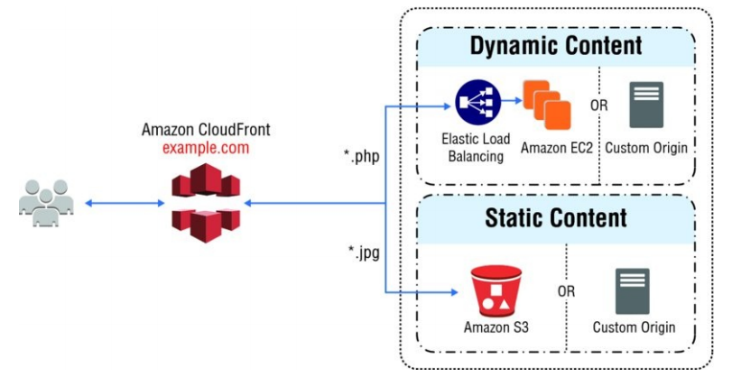
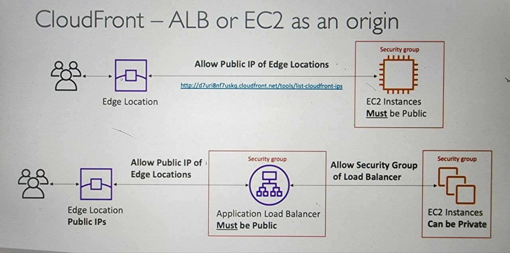
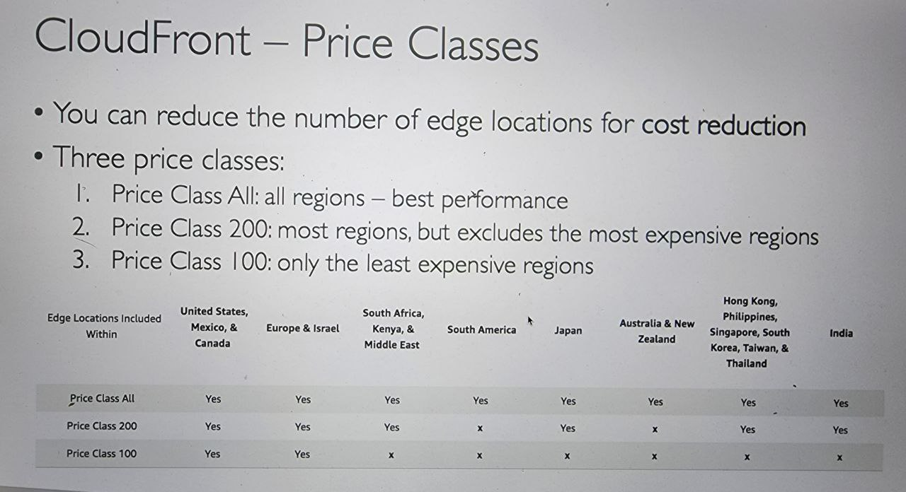
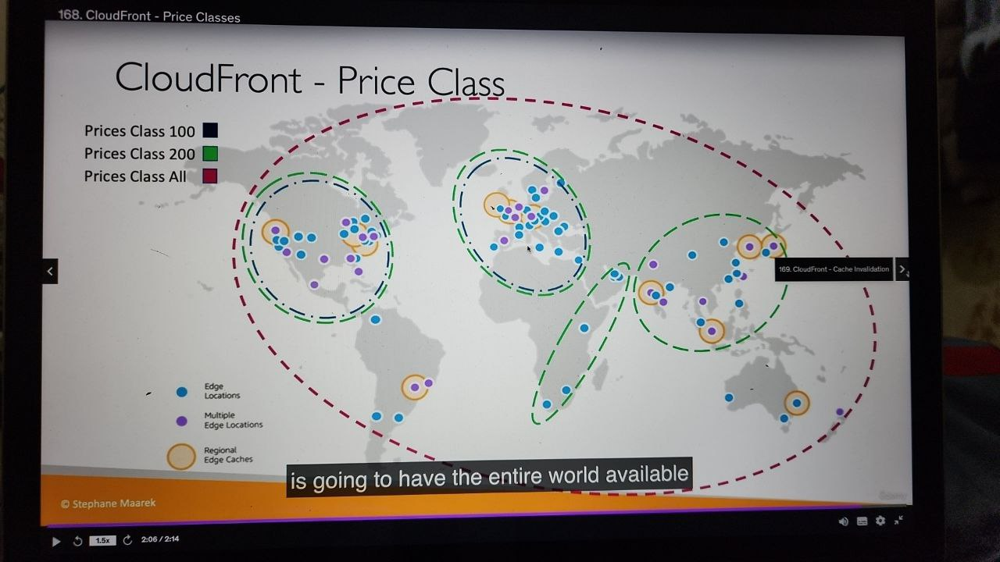
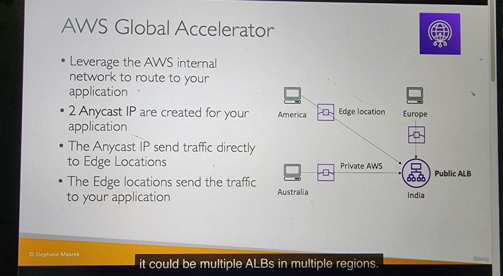
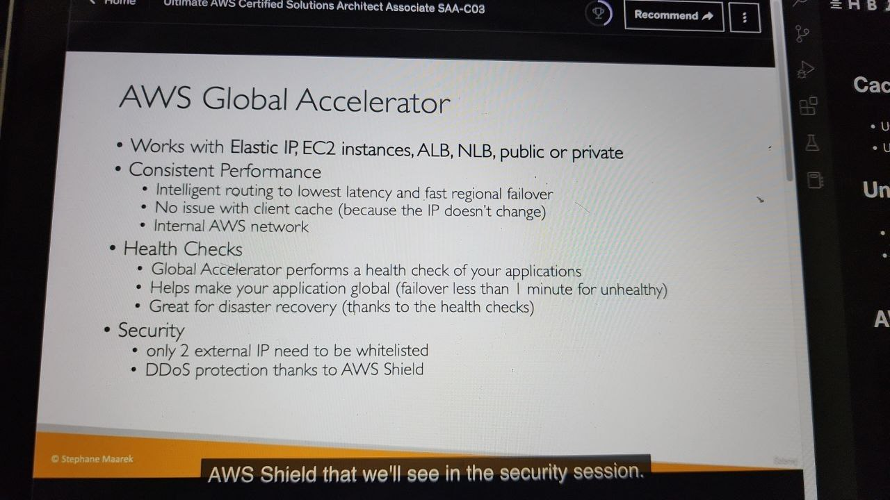
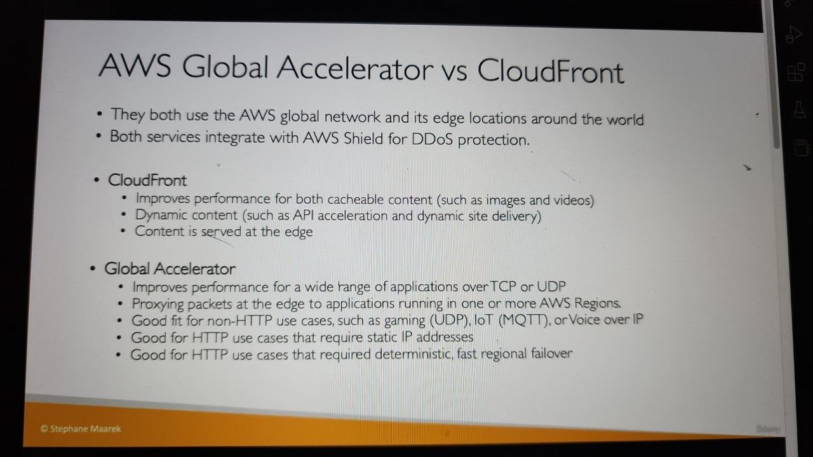

# CloundFront

- Content Delivery Network (CDN)
- Improve(enhance, boost, upgrade) read performance, content is cached at the edge
- improve UX
- 216 points of Presence globally (edge locations)
- DDOS protection(because worldwide), intergration with Shield, AWS web application Firewall

# CloudFront - Origins

- S3 bucket
  - for distributing fikes and caching them at the edge
  - enhanced security security with CloudFront ***Origin Access Control (OAC)***
  - OAC is replacing **Origin Acess Identity (OAI)**
  - Cloud Front can be used **as an ingress** (to upload files to S3)
- Custom Origin (Http)
  - Application Load Balancer
  - EC2 instance
  - S3 website (static)
  - 
  - Any HTTP backend you want

    

# CloudFront vs S3 Cross Region Replication

| CloudFront                                                 | S3 Cross Region Replication                                                            |
| ---------------------------------------------------------- | -------------------------------------------------------------------------------------- |
| Cache                                                      | Replicate                                                                              |
| Global Edge network (216 points)                           | Must be setup for each region                                                          |
| Files are cached for a TTL (maybe a day)                   | Files are updated in real-time                                                         |
| Great for static content that must be available everywhere | Great for dynamic content  that needs to be avaible at low-latency in few regions |
|                                                            |                                                                                        |

# ALB or EC2 as an origin

- 

# CloudFront Geo Restriction

- You can restrict who can access your distribution
  - AllowList: list of approved countries
  - BlockList: list of banned countries
- The "country" is determined using a 3rd party Geo-IP database
- Use case: Copyright Laws to control access to content

# CloudFront - Pricing

- CloundFront Edge locations are all around the world
- The cost of data out per edge locations varies
- **Cost reduction:** reduce the number of edge locations
- Three classes:
  - Price Class All: all regions - best performance
  - Price Class 200: most regions, but excludes the most expensive regions
  - Price Class 100: only the least expensive regions
  - 

# Cache Invalidation

- Using **CloudFront Invalidation**
- Use can invalidate all files or a special path

# Unicast IP vs AnyCast IP

- Unicast IP: 1 server -> 1 IP
- Anycast IP: many server -> 1 IP   -----> clients are routed to the nearest one

# AWS Global Accelerator

# CloudFront vs AWS Global Accelerator

