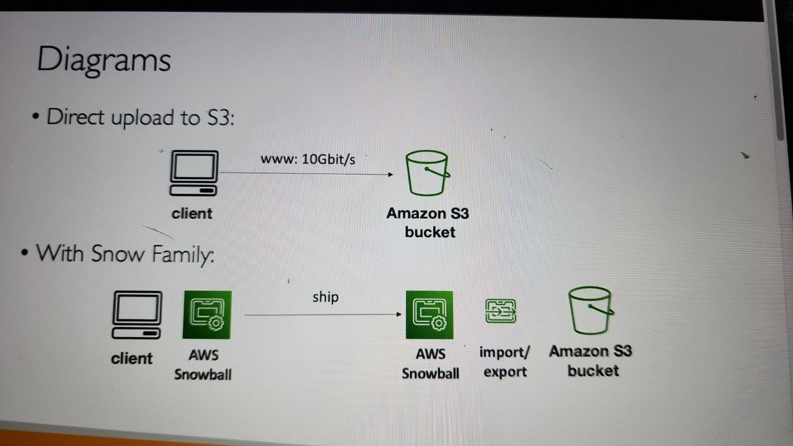

# AWS Snow Family

- High secure portable devices to collect and process data at the edge and migrate data into and out of AWS
- Data migration: Snowcone, SnowBall, SnowMobile
- Edge computing: SnowCone, Snowball Edge

# Data migration with AWS Snow family

- Challenges when you transfer data over the network:
  - Limited conectivity
  - Limited bandwidth
  - High network cost
  - Shared bandwidth (can NOT maximize the line)
  - Connection stability
- AWS Snow Family: offline devices to perform data migrations
- If it take more than a week to transfer over the network, use Snowball device
- 

# Solution Achitectủe: Snowball into Glacier

