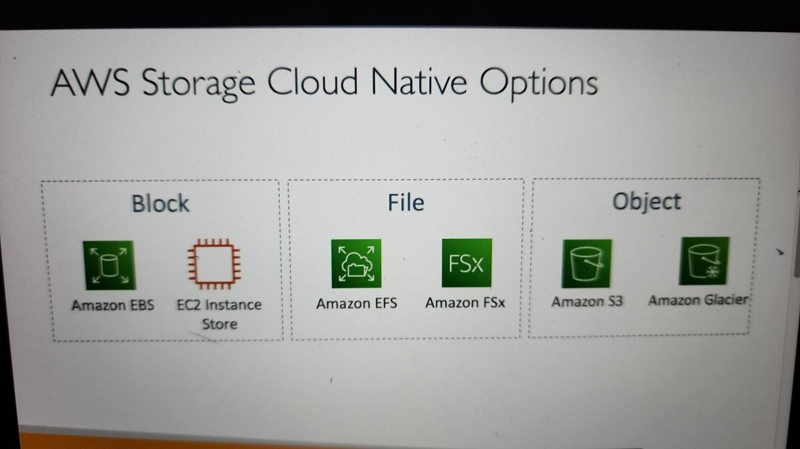
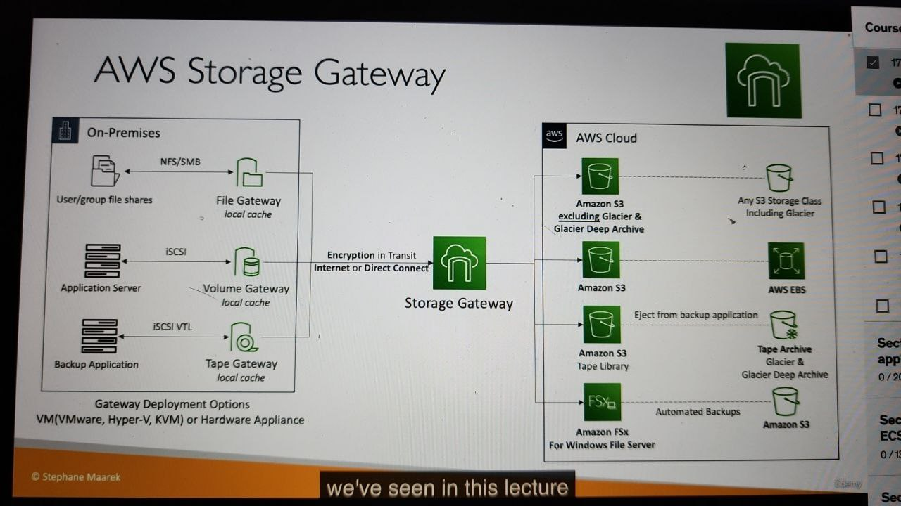

# AWS Snow Family

- High secure portable devices to collect and process data at the edge and migrate data into and out of AWS
- Data migration: Snowcone, SnowBall, SnowMobile
- Edge computing: SnowCone, Snowball Edge

# Data migration with AWS Snow family

- Challenges when you transfer data over the network:
  - Limited conectivity
  - Limited bandwidth
  - High network cost
  - Shared bandwidth (can NOT maximize the line)
  - Connection stability
- AWS Snow Family: offline devices to perform data migrations
- If it take more than a week to transfer over the network, use Snowball device
- 

# Solution Achitecture: Snowball into Glacier

# Amazon FSx

- Launch 3rd party high performance file systems on AWS
- Fully managed service
  - FSx for Lustre
    - is a type of parallel distributed file system, for large scale computing
    - Lustre = Linux + Cluster
    - Options:
      - Scratch File System: temporary, not replicated, high burst, short-term, optimize costs
      - Persistent File System: long-term, replicated within same AZ, replace failed files with minutes, sensitive data
  - FSx for NetApp ONTAP
    - Managed NetApp ONTAP on AWS
    - **supports NFS, SMB, iSCSI protocol**
    - Works with linux, windows, macos, vmware cloud on aws, amz workspace and appstream 2.0, EC2, ECS, EKS
    - **Point in time instantaneous cloning( helpful for testing new workloads)**
  - FSx for Windows File Server
    - support SMB protocol and Windows NTFS
    - **can be mounted on Linux EC2 instances**
    - supports **Microsoft's Distributed File System (DFS) Namespaces** (group files across multiple FS)
  - FSx for OpenZFS
    - Managed OpenZFS file system on AWS
    - supports NFS v3, v4, v4.1, v4.1
    - works with linux, windows, macos, vmware cloud, amz workspace, appstream 2.0, ec2, ecs, eks
    - **Point in time instantaneous cloning( helpful for testing new workloads)**
- 

# Storage gateway

- combine on-premises and cloud storage

  - 
  - 
  - 
- types:

  - S3 File gateway
    - 
  - FSx File gateway
    - 
  - Volume gateway
    - 
  - Tape gateway
    - 
- Storage gateway - Hardware appliance

  
- Summary
- 

# AWS Transfer Family

# Data Sync

- sync data between on-premises and AWS, or between AWS services
- 
- 
- 

# All AWS storage options compared

