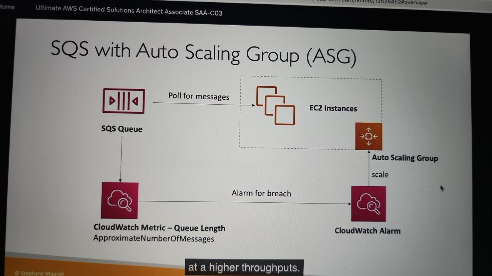
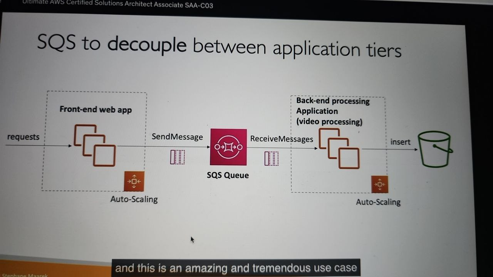
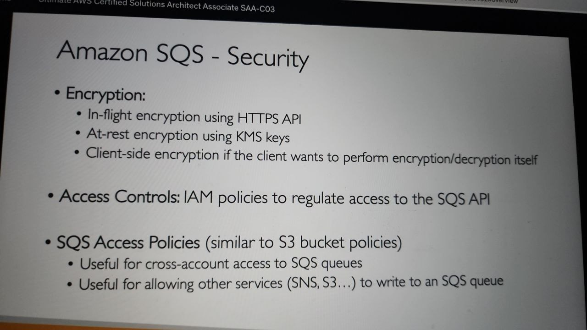
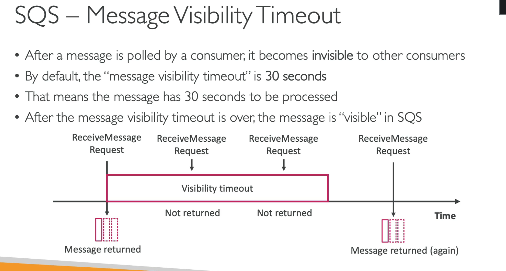
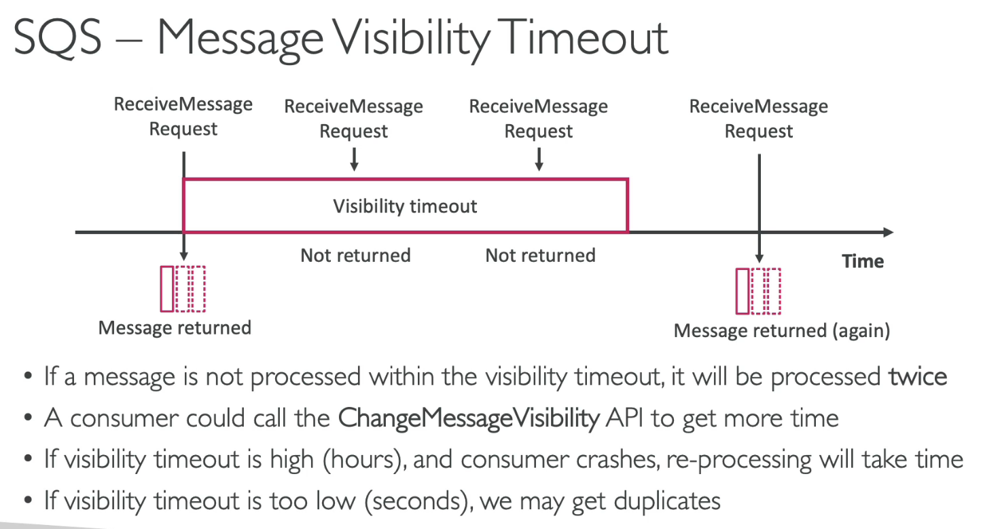
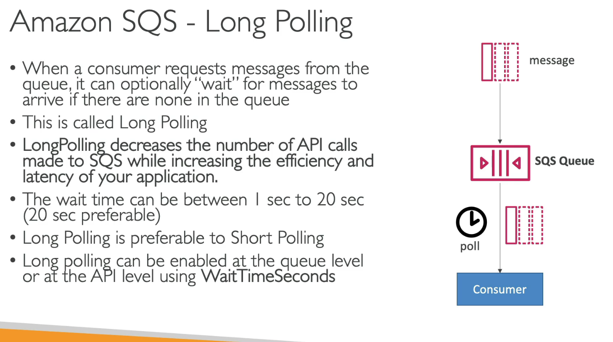
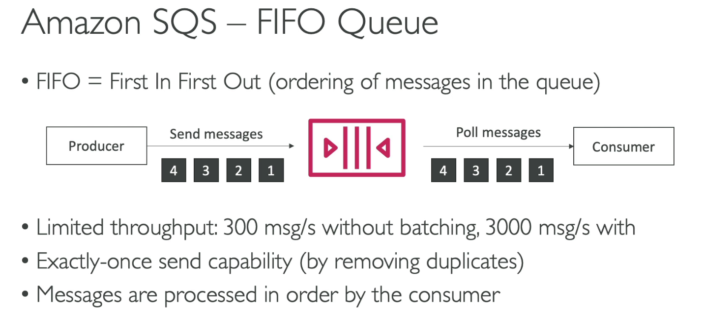
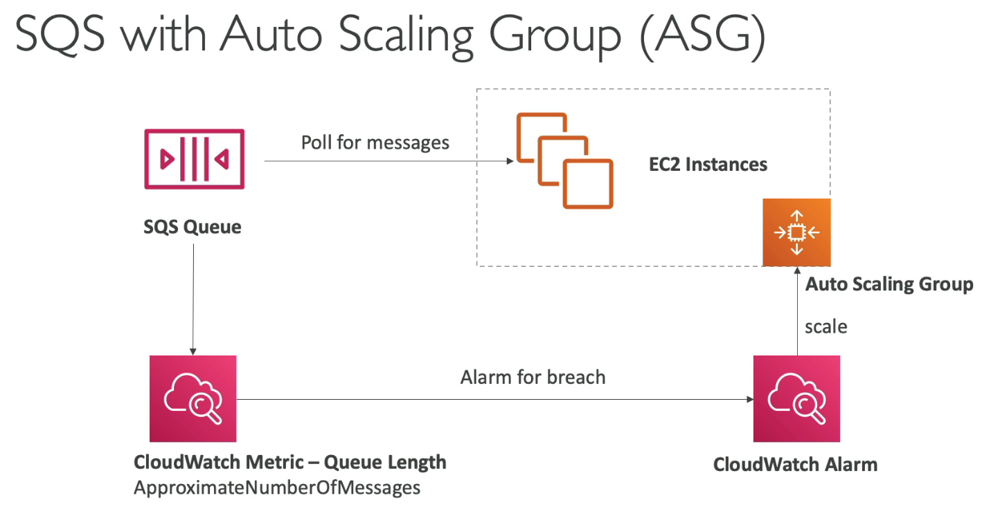
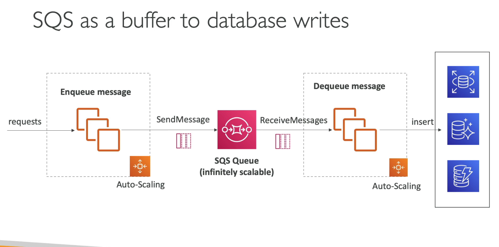
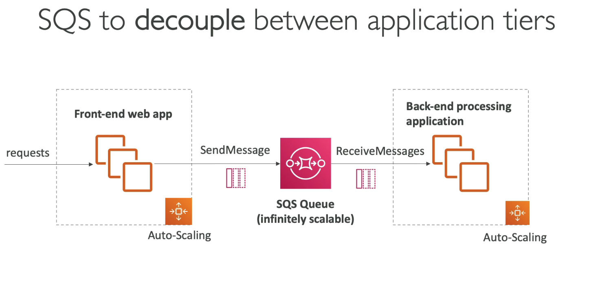

Contains: SQS, SNS, Kinesis, Active MQ

- [Introduction](#introduction)
- [SQS - Standard Queue](#sqs---standard-queue)
- [SQS - Message Visibility Timeout](#sqs---message-visibility-timeout)
- [SQS - Long polling](#sqs---long-polling)
- [SQS - FIFO Queue](#sqs---fifo-queue)

# Introduction

- 2 patterns of application communication:
  - synchronous: service to service
  - asynchronous/ event based: service -> queue -> service
- Synchronous communication can be problematic if there are sudden spikes of traffic
- In that case, it's better to decouple app:
  - using SQS: queue model
  - using SNS: pub/sub model
  - using Kenesis: real-time streaming model

# SQS - Standard Queue

- producers ---messages---> queue -----messages---> consumers
- SQS: Simple Queue Service
- oldest offering (over 10 years old)
- fully managed service, used to decouple applications
- attributes:

  - unlimited throughput, unlimited number of messages in queue
  - default retention of messages: 4 days, maximum of 14 days
  - low latency ( <10ms on publish and recieve)
  - limitation if 256KB per message sent
- Can have duplicate messages (at least once delivery, occasionally)
- Can have **out of order** message (best effort ordering)
- Producer: SDK (SendMessage API)
- Consumer:

  - running on EC2, servers, AWS lambda,..
  - polls SQS for messages (recieve up to 10 messages at a time)
  - after that, it can use DeleteMessageAPI
- SQS with ASG (auto scaling group)
- 
- Decouple application tier

  - image
- SQS Security

  - image

# SQS - Message Visibility Timeout

- 
- 
- Hands on: Config `visibility timeout` (0s -> 12 hours)

# SQS - Long polling

Hands on: Config `recieve message wait time`

# SQS - FIFO Queue

- Hands on:
  - Queue name has to be ended with '.fifo'

# SQS with ASG

- ASG: auto scaling group
- Set threshold to create alarm, if number of messages is more than the threshold, an alarm will be created, and CloudWatch alarm will send an event to ASG to create more EC2 instances
  - 
- To decrease load of DB, using SQS as a buffer to DB writes (when client does not require the result)
  - 
- SQS  can be used to decouple between app tiers
  - 
