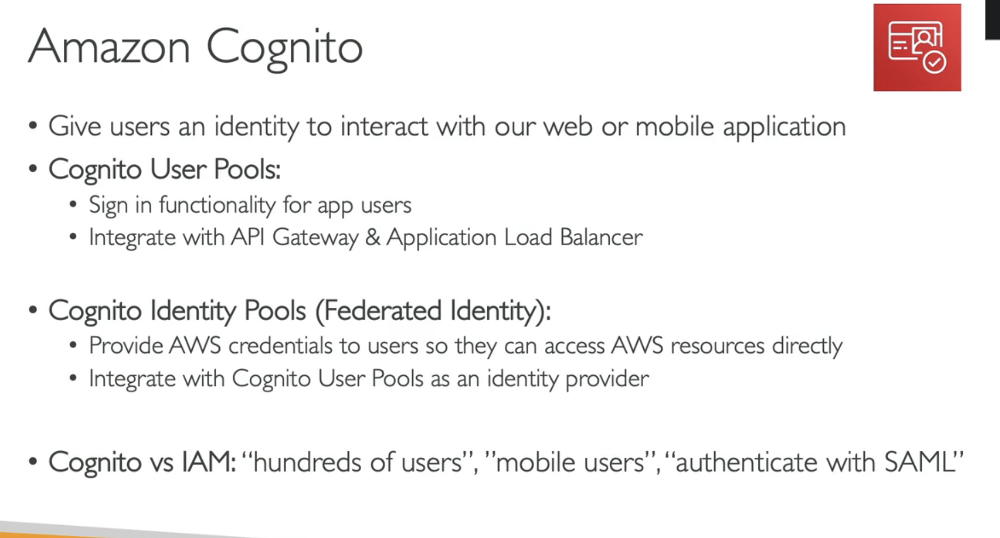
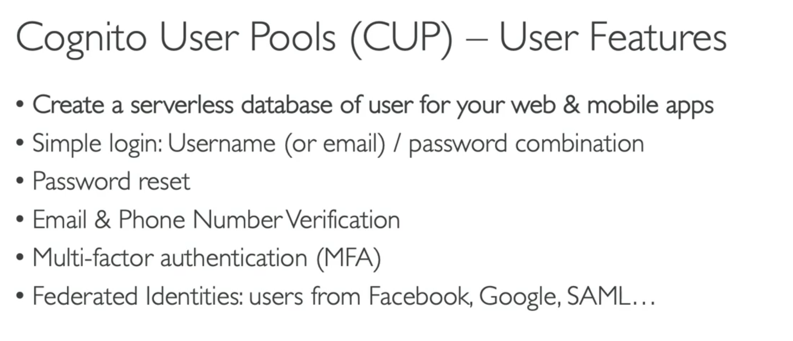
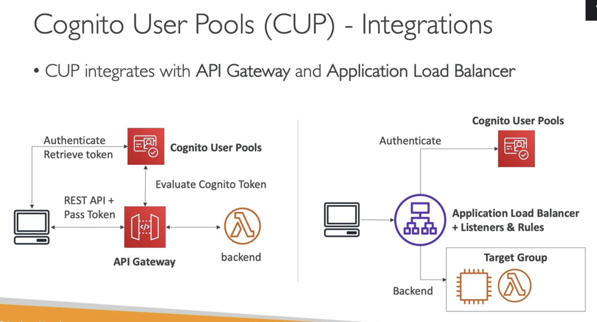

# Serverless Overveiew from a Solution Architect

- [Serverless Overveiew from a Solution Architect](#serverless-overveiew-from-a-solution-architect)
- [Introduction](#introduction)
- [Lambda Overview](#lambda-overview)
- [Lambda Edge and CloudFront Function](#lambda-edge-and-cloudfront-function)
- [RDS -  Invoking Lambda and Event Notifications](#rds----invoking-lambda-and-event-notifications)
- [Amazon DynamoDB](#amazon-dynamodb)
- [API Gateway Overview](#api-gateway-overview)
- [Amazon Cognito Overview](#amazon-cognito-overview)

# Introduction

# Lambda Overview
- Lambda's maximum execution time is 15 minutes. You can run your code somewhere else such as an EC2 instance or use Amazon ECS.
- AWS Step Function allows you to build Serverless workflows using AWS services (e.g., Lambda) and supports human approval
  
# Lambda Edge and CloudFront Function
- An Edge-Optimized API Gateway is best for geographically distributed clients. API requests are routed to the nearest CloudFront Edge Location which improves latency. The API Gateway still lives in one AWS Region.
- Lambda@Edge is a feature of CloudFront that lets you run code closer to your users, which improves performance and reduces latency.
  
# RDS -  Invoking Lambda and Event Notifications

# Amazon DynamoDB
- DynamoDB is serverless with no servers to provision, patch, or manage and no software to install, maintain or operate. It automatically scales tables up and down to adjust for capacity and maintain performance. It provides both provisioned (specify RCU & WCU) and on-demand (pay for what you use) capacity modes.
- RCU and WCU are decoupled, so you can increase/decrease each value separately.
- DynamoDB Accelerator (DAX) is a fully managed, highly available, in-memory cache for DynamoDB that delivers up to 10x performance improvement. It caches the most frequently used data, thus offloading the heavy reads on hot keys off your DynamoDB table, hence preventing the "ProvisionedThroughputExceededException" exception.
- DynamoDB Streams allows you to capture a time-ordered sequence of item-level modifications in a DynamoDB table. It's integrated with AWS Lambda so that you create triggers that automatically respond to events in real-time.
- The maximum size of an item in a DynamoDB table is 400KB
- A website is currently in the development process and it is going to be hosted on AWS. There is a requirement to store user sessions for users logged in to the website with an automatic expiry and deletion of expired user sessions. Which of the following AWS services are best suited for this use case?
  - Save session to DynamoDB and use TTL
  - 
# API Gateway Overview

# Amazon Cognito Overview

  
  
 
- You have a mobile application and would like to give your users access to their own personal space in the S3 bucket. How do you achieve that?
     - Use Amazon Cognito Identity Federation
     - Amazon Cognito can be used to federate mobile user accounts and provide them with their own IAM permissions, so they can be able to access their own personal space in the S3 bucket.
- You are developing a new web and mobile application that will be hosted on AWS and currently, you are working on developing the login and signup page. The application backend is serverless and you are using Lambda, DynamoDB, and API Gateway. Which of the following is the best and easiest approach to configure the authentication for your backend?
  - Use CUP
- You are running a mobile application where you want each registered user to upload/download images to/from his own folder in the S3 bucket. Also, you want to give your users to sign-up and sign in using their social media accounts (e.g., Facebook). Which AWS service should you choose?
  - Cognito
  - Amazon Cognito lets you add user sign-up, sign-in, and access control to your web and mobile apps quickly and easily. Amazon Cognito scales to millions of users and supports sign-in with social identity providers, such as Apple, Facebook, Google, and Amazon, and enterprise identity providers via SAML 2.0 and OpenID Connect.
  

 
