- [Mobile app: My Todo List](#mobile-app-my-todo-list)
- [My Blog .com](#my-blog-com)
- [Microservices Architecture](#microservices-architecture)
- [Sofware updates offloading](#sofware-updates-offloading)
- [Quiz](#quiz)
  

# Mobile app: My Todo List
- Read a lot and write little
  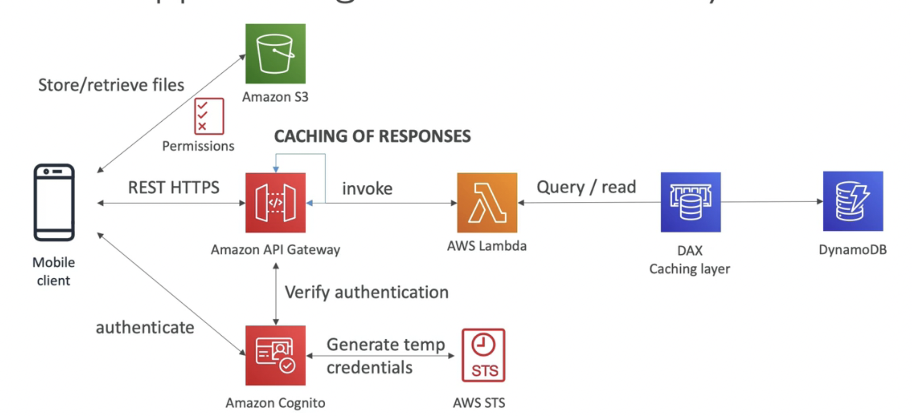  
- Note
  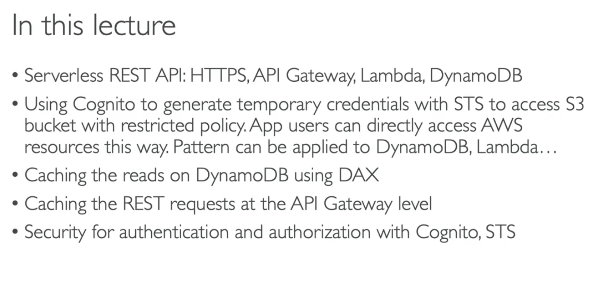  


# My Blog .com
- Requirements:
  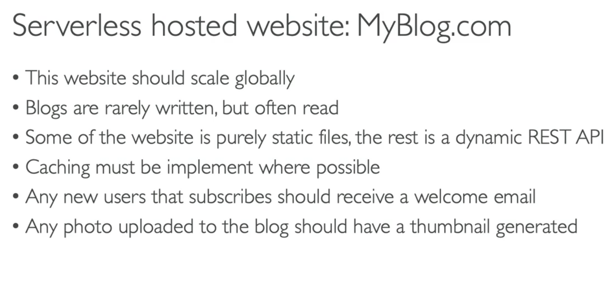  

- Email flow:
  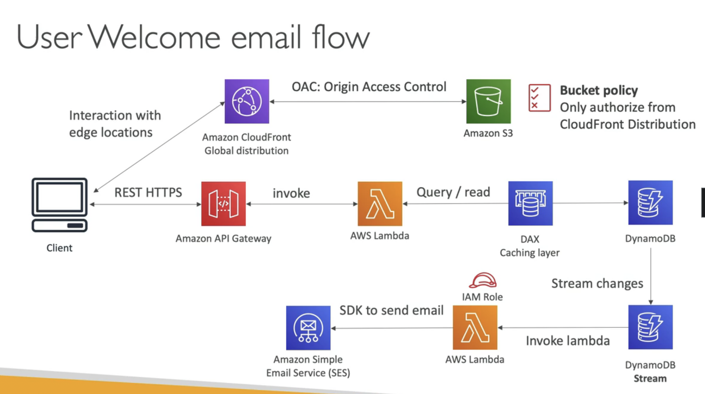  

- Thumbnail Generation flow
  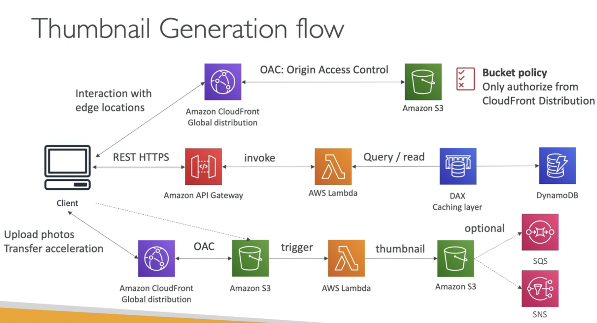  

- Note:
  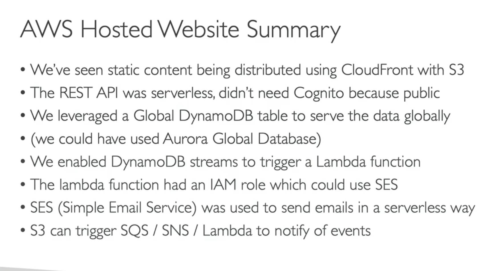  


# Microservices Architecture
- Microservice
  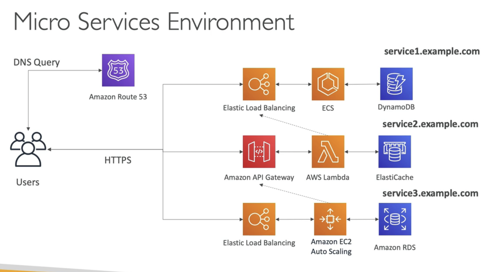  

- 2 patterns:
  - Synchronous patterns: API Gateway, Load Balancers
  - SQS, Kinesis, SNS, Lambda triggers (S3)
- Discussions:
  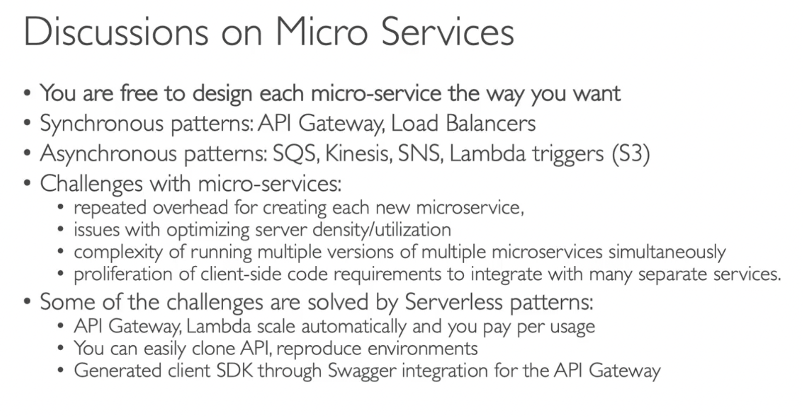  

# Sofware updates offloading
- Requirements
  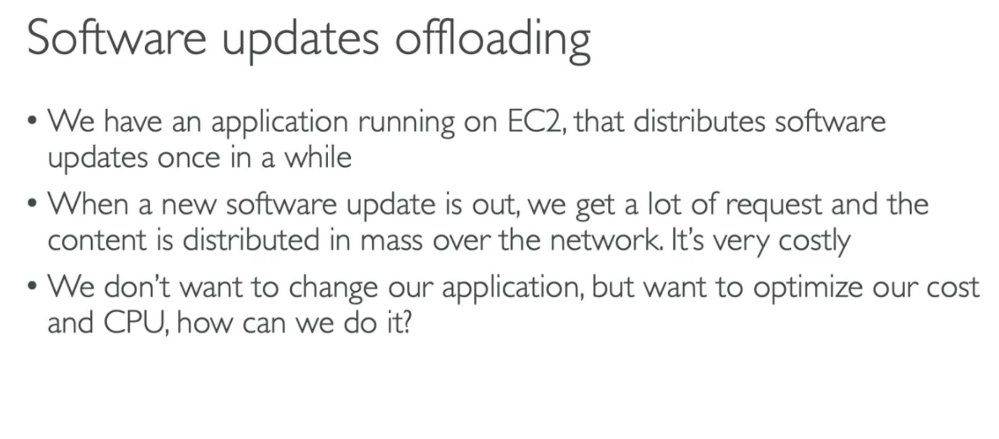  

- Current:
  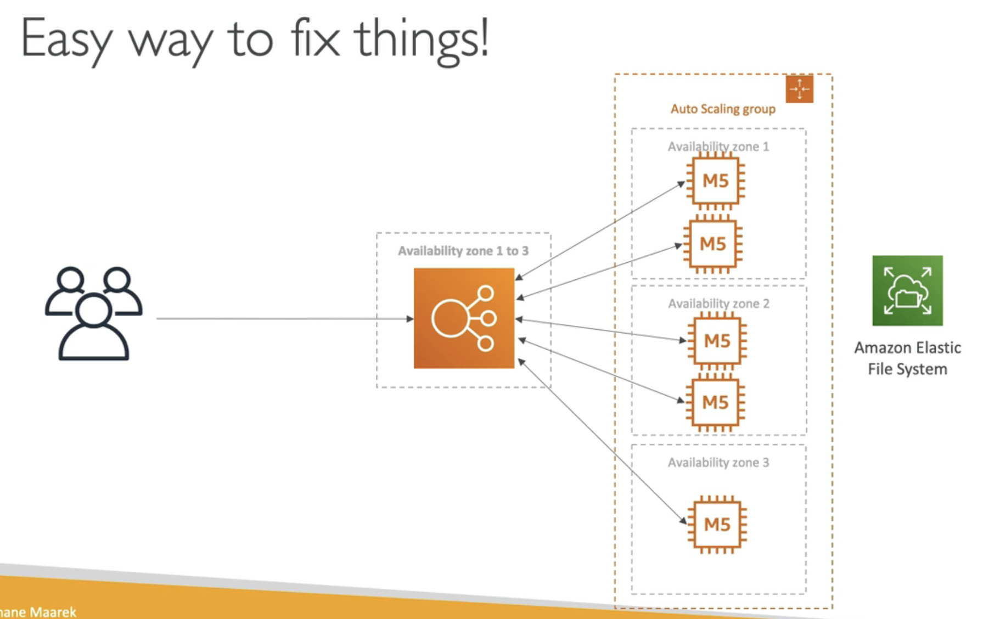  
- Solution: (add CloudFront) - (caching - easy and cheap)
  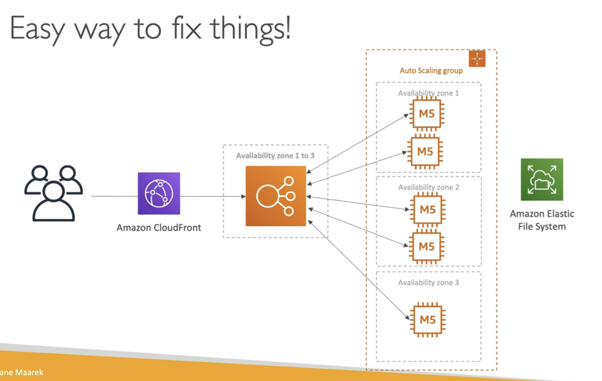  

  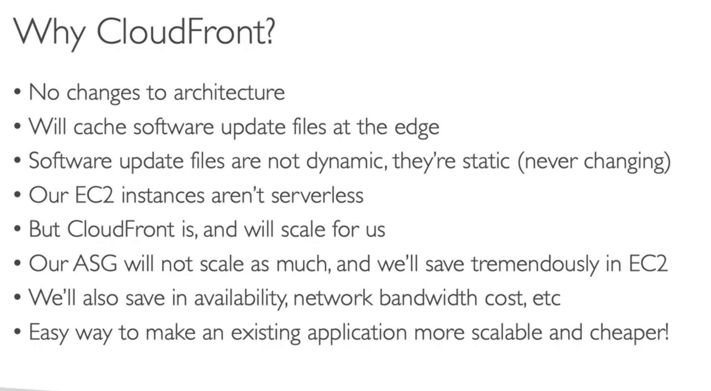  


# Quiz
- A startup company plans to run its application on AWS. As a solutions architect, the company hired you to design and implement a fully Serverless REST API. Which technology stack do you recommend?
  - **API Gateway + Lambda**
  - ALB + EC2
  - ECS + EBS
  - CloudFront + S3

- The following AWS services have an out of the box caching feature, EXCEPT .................
  - API Gateway
  - **Lambda** ```Lambda does not have an out-of-the-box caching feature.```
  - DynamoDB
  
- You have a lot of static files stored in an S3 bucket that you want to distribute globally to your users. Which AWS service should you use?
  - **CloudFront** `Amazon CloudFront is a fast content delivery network (CDN) service that securely delivers data, videos, applications, and APIs to customers globally with low latency, high transfer speeds. This is a perfect use case for Amazon CloudFront.`

- You have created a DynamoDB table in ap-northeast-1 and would like to make it available in eu-west-1, so you decided to create a DynamoDB Global Table. What needs to be enabled first before you create a DynamoDB Global Table?
  - **DynamoDB Stream** `DynamoDB Streams enable DynamoDB to get a changelog and use that changelog to replicate data across replica tables in other AWS Regions.`
  - DAX
  - DynamoDB Versioning
  - DynamoDB Backups

- You have configured a Lambda function to run each time an item is added to a DynamoDB table using DynamoDB Streams. The function is meant to insert messages into the SQS queue for further long processing jobs. Each time the Lambda function is invoked, it seems able to read from the DynamoDB Stream but it isn't able to insert the messages into the SQS queue. What do you think the problem is?
  - Lambda cant be used to insert messages into the SQS queue, use an EC2 instance instead
  - **The Lambda Execution IAM Role is missing permissions**
  - The Lambda security group must allow outbound access to SQS
  - The SQS security group must be edited to allow AWS Lambda. `Wrong. Security Groups can not be attached to SQS queues.`

- You would like to create an architecture for a micro-services application whose sole purpose is to encode videos stored in an S3 bucket and store the encoded videos back into an S3 bucket. You would like to make this micro-services application reliable and has the ability to retry upon failures. Each video may take over 25 minutes to be processed. The services used in the architecture should be asynchronous and should have the capability to be stopped for a day and resume the next day from the videos that haven't been encoded yet. Which of the following AWS services would you recommend in this scenario?
  - S3 + Lambda
  - SNS + EC2
  - **SQS + EC2** `Amazon SQS allows you to retain messages for days and process them later, while we can take down our EC2 instances.`
  - SQS +  Lambda `Wrong. This would work, but it can't be used in this scenario as the maximum execution time for a Lambda function is 15 minutes.`

- You are running a photo-sharing website where your images are downloaded from all over the world. Every month you publish a master pack of beautiful mountain images that are over 15 GB in size. The content is currently hosted on an Elastic File System (EFS) file system and distributed by an Application Load Balancer and a set of EC2 instances. Each month, you are experiencing very high traffic which increases the load on your EC2 instances and increases network costs. What do you recommend to reduce EC2 load and network costs without refactoring your website?
  - Hosts the master pack into S3
  - Enable ALB Caching
  - Scale up the EC2 instances
  - **Create a CloudFront Distribution** `Amazon CloudFront is a fast content delivery network (CDN) service that securely delivers data, videos, applications, and APIs to customers globally with low latency, high transfer speeds. Amazon CloudFront can be used in front of an Application Load Balancer.`
- An AWS service allows you to capture gigabytes of data per second in real-time and deliver these data to multiple consuming applications, with a replay feature.
  - Kinesis Data Streams
  - S3
  - **Amazon MQ** `Amazon Kinesis Data Streams (KDS) is a massively scalable and durable real-time data streaming service. It can continuously capture gigabytes of data per second from hundreds of sources such as website clickstreams, database event streams, financial transactions, social media feeds, IT logs, and location-tracking events.`