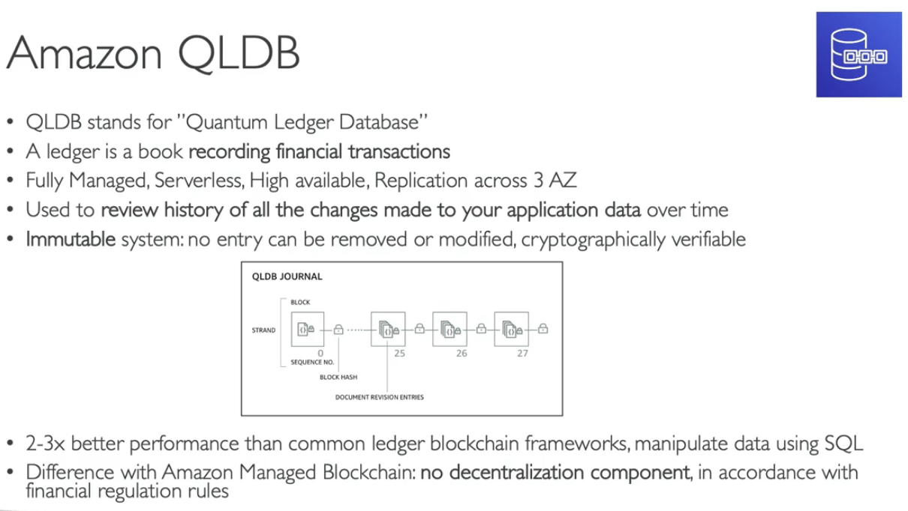

- [Choosing the Right Database](#choosing-the-right-database)
- [RDS](#rds)
- [Aurora](#aurora)
- [ElasticCache](#elasticcache)
- [DynamoDB](#dynamodb)
- [S3](#s3)
- [DocumentDB](#documentdb)
- [Neptune](#neptune)
- [Keyspaces (for Apache Cassandra)](#keyspaces-for-apache-cassandra)
- [QLDB (Quantum Ledger Database)](#qldb-quantum-ledger-database)
- [Timestream](#timestream)
- [Quiz](#quiz)

# Choosing the Right Database
-   

-   

# RDS
- Relational Database Service
-   

# Aurora
-   

# ElasticCache
-   

# DynamoDB
- DAX: DynamoDB Accelerator
- active-active setup : can read and write at any replicas
- PITR: point in time recovery
- RCU: read capacity unit
- WCU: write capacity unit
-   

# S3
- SSE: server side encryption
- KMS: key management service
-   

# DocumentDB
- based on top of MongoDB
-   

# Neptune
- Graph DB
-   

# Keyspaces (for Apache Cassandra)
-   

# QLDB (Quantum Ledger Database)
-   

# Timestream
-   
-   

# Quiz
- Which database helps you store relational datasets, with SQL language compatibility and the capability of processing transactions such as insert, update, and delete?
  - **Amazon RDS**

- Which AWS service provides you with caching capability that is compatible with Redis API?
  - **Amazon ElastiCache** `is a fully managed in-memory data store, compatible with Redis or Memcached.`

- You want to migrate an on-premises MongoDB NoSQL database to AWS. You don't want to manage any database servers, so you want to use a managed NoSQL database, preferably Serverless, that provides you with high availability, durability, and reliability, and the capability to take your database global. Which database should you choose?
  - **Amazon DynamoDB** `is a key-value, document, NoSQL database.`
  - RDS
  - TimeStream
  - Aurora

- You are looking to perform Online Transaction Processing (OLTP). You would like to use a database that has built-in auto-scaling capabilities and provides you with the maximum number of replicas for its underlying storage. What AWS service do you recommend?
  - **Amazon Aurora** `is a MySQL and PostgreSQL-compatible relational database. It features a distributed, fault-tolerant, self-healing storage system that auto-scales up to 128TB per database instance. It delivers high performance and availability with up to 15 low-latency read replicas, point-in-time recovery, continuous backup to Amazon S3, and replication across 3 AZs.`

- As a Solutions Architect, a startup company asked you for help as they are working on an architecture for a social media website where users can be friends with each other, and like each other's posts. The company plan on performing some complicated queries such as "What are the number of likes on the posts that have been posted by the friends of Mike?". Which database do you recommend?
  - **Amazon Neptune** `is a fast, reliable, fully-managed graph database service that makes it easy to build and run applications that work with highly connected datasets.`

- You have a set of files, 100MB each, that you want to store in a reliable and durable key-value store. Which AWS service do you recommend?
  - **Amazon S3** `is indeed a key-value store! (where the key is the full path of the object in the bucket)`

- A company has an on-premises website that uses ReactJS as its frontend, NodeJS as its backend, and MongoDB for the database. There are some issues with the self-hosted MongoDB database as there is a lot of maintenance required and they don’t have and can’t afford the resources or experience to handle those issues. So, a decision was made to migrate the website to AWS. They have decided to host the frontend ReactJS application in an S3 bucket and the NodeJS backend on a set of EC2 instances. Which AWS service can they use to migrate the MongoDB database that provides them with high scalability and availability without making any code changes?
  - **DocumentDB**

- A company using a self-hosted on-premises Apache Cassandra database which they want to migrate to AWS. Which AWS service can they use which provides them with a fully managed, highly available, and scalable Apache Cassandra database?
  - **Keyspaces**

- An online payment company is using AWS to host its infrastructure. Due to the application’s nature, they have a strict requirement to store an accurate record of financial transactions such as credit and debit transactions. Those transactions must be stored in secured, immutable, encrypted storage which can be cryptographically verified. Which AWS service is best suited for this use case?
    - **QLDB**

- A startup is working on developing a new project to reduce forest fires due to climate change. The startup is developing sensors that will be spread across the entire forest to make some readings such as temperature, humidity, and pressures which will help detect the forest fires before it happens. They are going to have thousands of sensors that are going to store a lot of readings each second. There is a requirement to store those readings and do fast analytics so they can predict if there is a fire. Which AWS service can they use to store those readings?
  - **Timestream**

