- [Amazon Rekognition](#amazon-rekognition)
- [Transcribe](#transcribe)
- [Amazon Polly](#amazon-polly)
- [Amazon Translate](#amazon-translate)
- [Amazon Lex and Connect](#amazon-lex-and-connect)
- [Amazon Comprehend](#amazon-comprehend)
- [Amazon Comprehend Medical](#amazon-comprehend-medical)
- [SageMaker](#sagemaker)
- [Amazon Forecast](#amazon-forecast)
- [Amazon Kendra](#amazon-kendra)
- [Amazon Personalize](#amazon-personalize)
- [Amazon Textract](#amazon-textract)
- [Summary](#summary)
- [Quiz](#quiz)


# Amazon Rekognition
- related to images and videos
- 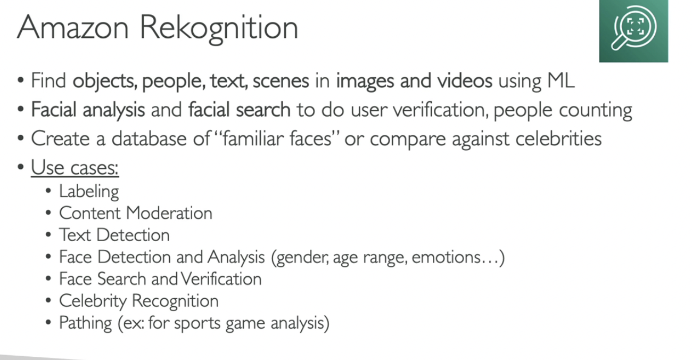  
- Content Moderation
- 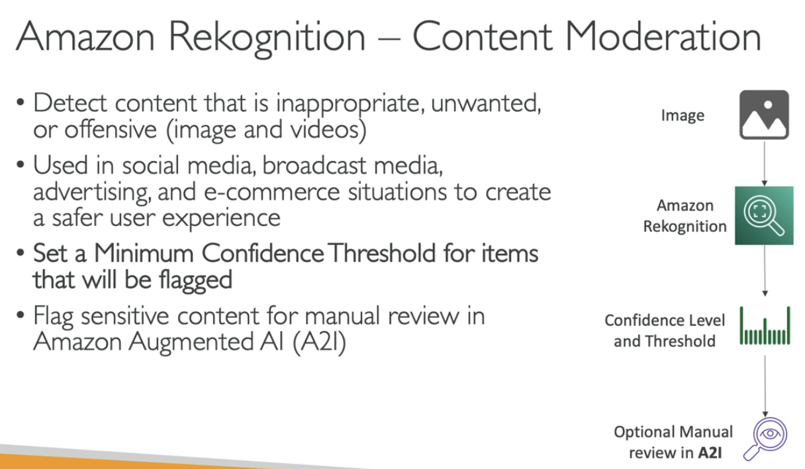  


# Transcribe
- speexh to text, auto remove PII, auto language indentification
- Usecases:
  - transcribe customer service calls
  - captioning and subtitling
  - gen metadata for media to create fully searchable archive
  

# Amazon Polly
- text to speech
-   
- Example of SSML:
    ```
    <speak> 
        Hi! My name is Van.
        <break time ="3s"/> 
        Nice to meet you. 
    </speak>
    ```


# Amazon Translate
- translate


# Amazon Lex and Connect
- Amazon Lex:
  - same tech with Alexa
  - natural language understanding (NLU)
  - build chatbots, call center bots
- Amazon Connect:
  - receive calls, create contact flows, cloud-based virtual contact center
  - Can intergrate with other CRM systems or AWS
  - No upfront payments, 80% cheaper than traditional contact center solutions
- 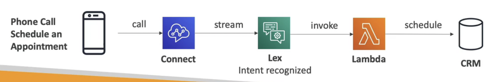  


# Amazon Comprehend
- for NLP
- fully managed and serverless service
- 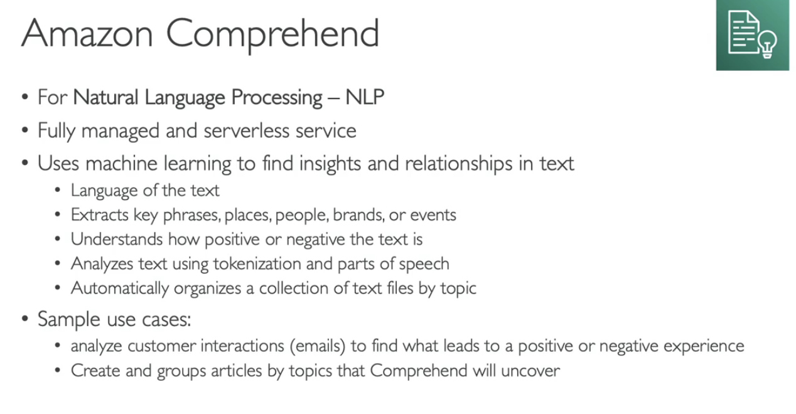  


# Amazon Comprehend Medical
- 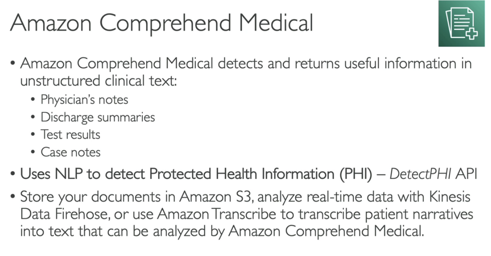  


# SageMaker
- 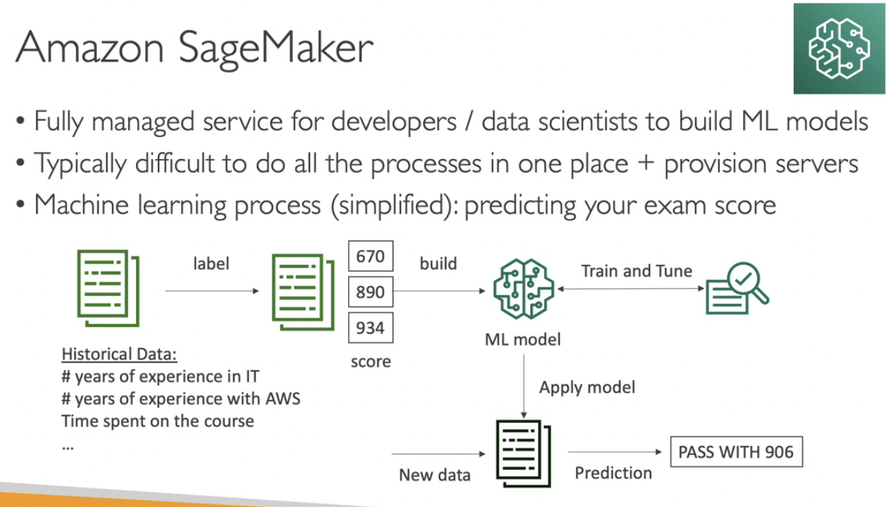  


# Amazon Forecast
- 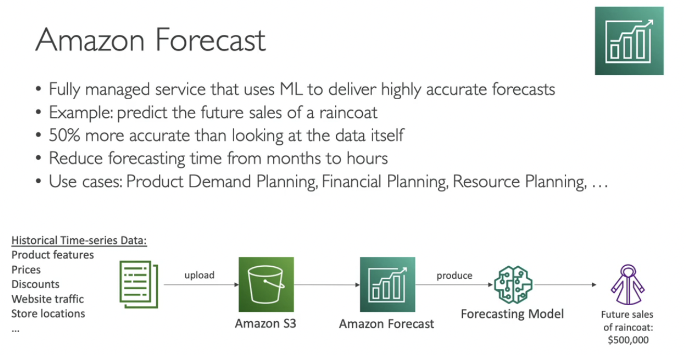  


# Amazon Kendra
- document search by ML
- 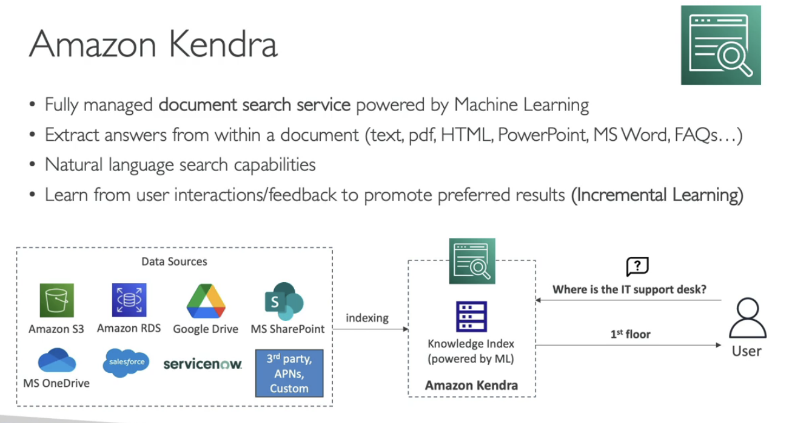  


# Amazon Personalize
- recommendation
- 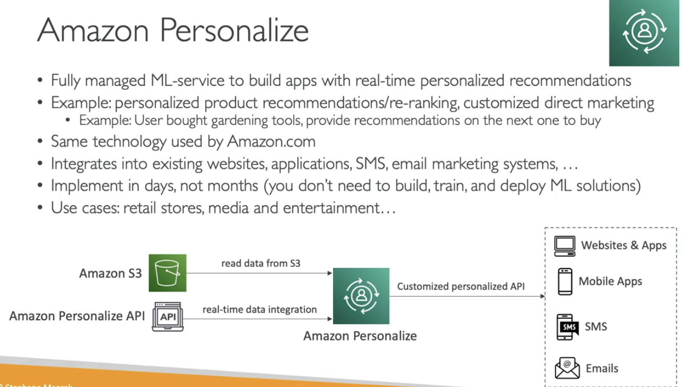  


# Amazon Textract
- image, pdf,... to text
- 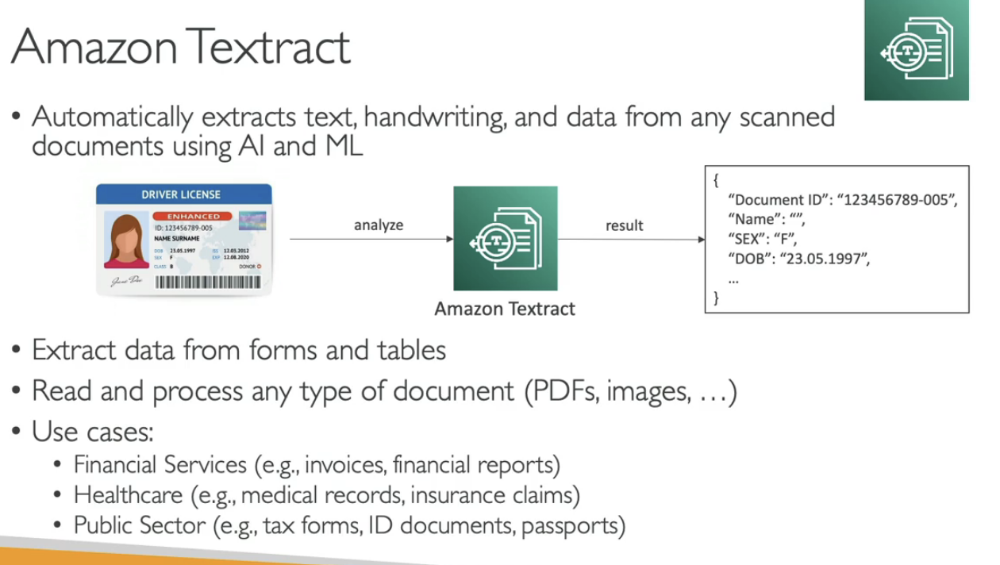  


# Summary
- 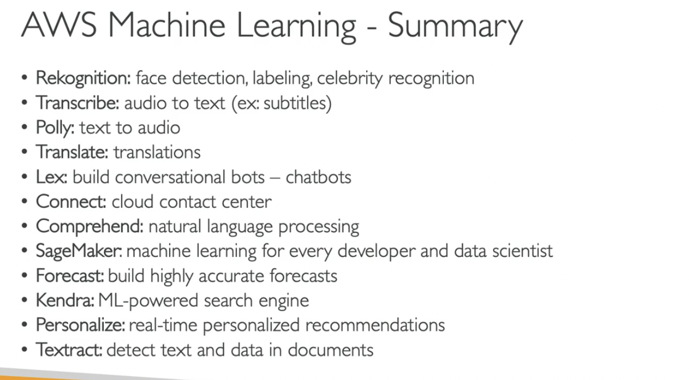  


# Quiz

- You should use Amazon Transcribe to turn text into lifelike speech using deep learning.
  - **False** `Amazon Transcribe is an AWS service that makes it easy for customers to convert speech-to-text. Amazon Polly is a service that turns text into lifelike speech.`


- A company would like to implement a chatbot that will convert speech-to-text and recognize the customers' intentions. What service should it use?
  - **Lex** `Amazon Lex is a service for building conversational interfaces into any application using voice and text. Lex provides the advanced deep learning functionalities of automatic speech recognition (ASR) for converting speech to text, and natural language understanding (NLU) to recognize the intent of the text, to enable you to build applications with highly engaging user experiences and lifelike conversational interactions.`


- Which fully managed service can deliver highly accurate forecasts?
  - **Forecast**


- You would like to find objects, people, text, or scenes in images and videos. What AWS service should you use?
  - **Rekognition** `Amazon Rekognition makes it easy to add image and video analysis to your applications using proven, highly scalable, deep learning technology that requires no machine learning expertise to use.`


- A start-up would like to rapidly create customized user experiences. Which AWS service can help?
  - **Personalize**


- A research team would like to group articles by topics using Natural Language Processing (NLP). Which service should they use?
  - **Comprehend** `Amazon Comprehend is a natural language processing (NLP) service that uses machine learning to find meaning and insights in text.`


- A company would like to convert its documents into different languages, with natural and accurate wording. What should they use?
  - **Translate** `Amazon Translate is a neural machine translation service that delivers fast, high-quality, and affordable language translation.`


- A developer would like to build, train, and deploy a machine learning model quickly. Which service can he use?
  - **SageMaker** `Amazon SageMaker is a fully managed service that provides every developer and data scientist with the ability to build, train, and deploy machine learning (ML) models quickly. SageMaker removes the heavy lifting from each step of the machine learning process to make it easier to develop high quality models.`


- Which AWS service makes it easy to convert speech-to-text?
  - **Transcribe**


- Which of the following services is a document search service powered by machine learning?
  - **Kendra** `Amazon Kendra is a highly accurate and easy to use enterprise search service that’s powered by machine learning.`


- A company is managing an image and video sharing platform which is used by customers around the globe. The platform is running on AWS using an S3 bucket to host both images and videos and using CloudFront as the CDN to deliver content to customers all over the world with low latency. In the last couple of months, a lot of customers have complained that they have started to see inappropriate content on the platform which started to increase in the last week. It will be very expensive and time-consuming to manually approve those images and videos by employees before its published on the platform. There is a requirement to find a solution that can automatically detect inappropriate and offensive images and videos and give you the ability to set a minimum confidence threshold for items that will be flagged and allows for manual review. Which AWS service can fit the requirement?
  - **Rekognition**, classify the videos and images


- An online medical company that allows you to book an appointment with doctors using through a phone call is using AWS to host their infrastructure. They are using Amazon Connect and Amazon Lex to receive calls and create a workflow, book an appointment, and pay. According to the company’s policy, all calls must be recorded for review. But, there is a requirement to remove any Personally Identifiable Information (PII) from the call before it's saved. What do you recommend to use which helps in removing PII from calls?
  - Transcribe


- Amazon Polly allows you to turn text into speech. It has two important features. First is ……………….. which allows you to customize the pronunciation of words (e.g., “Amazon EC2” will be “Amazon Elastic Compute Cloud”). The second is ……………….. which allows you to emphasize words, including breathing sounds, whispering, and more.
    - **Pronunciation Lexicons**, **Speech Synthesis Markup Language (SSML)**


- A medical company is in the process of implementing a solution to detect, extract, and analyze information from unstructured medical text like doctors’ notes, clinical trial reports, and radiology reports. Those documents are uploaded and stored on S3 buckets. According to the company’s regulations, the solution must be designed and implemented to keep patients’ privacy by identifying Protected Health Information (PHI) so the solution will be eligible with HIPAA. Which AWS service should you use?
    - **Amazon Comprehend Medical**