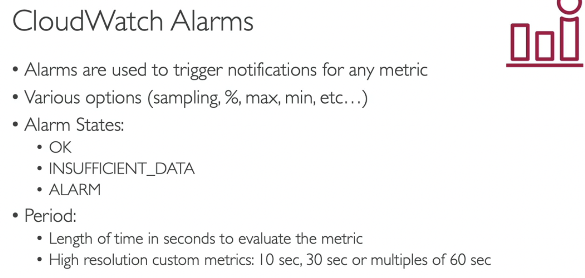

- [CloudWatch Metrics](#cloudwatch-metrics)
- [CloudWatch Logs](#cloudwatch-logs)
- [CLoudWatch Agent and CloudWatch Logs Agent](#cloudwatch-agent-and-cloudwatch-logs-agent)
- [CloudWatch Alarms](#cloudwatch-alarms)
- [EventBridge](#eventbridge)
- [CloudWatch Insights and Operational Visibility](#cloudwatch-insights-and-operational-visibility)
- [CloudTrail](#cloudtrail)
- [CloudTrail - EventBridge Integration](#cloudtrail---eventbridge-integration)
- [AWS Config](#aws-config)
- [CloudTrail vs CloudWatch vs Config](#cloudtrail-vs-cloudwatch-vs-config)
- [Quiz](#quiz)

# CloudWatch Metrics
- CloudWatch Metrics
-   
- CloudWatch Metric Streams
-   

# CloudWatch Logs
-   
- Sources:
-   
- Logs Insight: logs -query-> graph,...
-   
- S3 export
-   
- Subscription
-   
-   
-   

# CLoudWatch Agent and CloudWatch Logs Agent
- Logs for EC2
  -   
- Agent Types:
  - AgentLogs Egent (send only logs)
  - Unified Agent (send both logs and metrics)
  -   
- Metrics:
  -   

# CloudWatch Alarms
- to send noti for any metric
  -   
- Targets:
  - EC2: stop, terminate, reboot, recover
  - EC2 Auto Scaling: trigger scaling action
  - SNS: send noti
- Composite Alarms
  - are monitoring the states of multiple other alarms
  - use AND, OR conditions
  - helpful to reduce "alarm noise"
  -   
- EC2 Instance Recovery
  -   
- good to know:
  -   

# EventBridge
- (formerly CloudWatch Events)
- schedule: cron jobs - ex: triger lambda every hour
- event patterns: event rules to react to a service doing sth - ex: sign in event -> send email
-   
- Event Bus Types:
  - Default EB
  - Partner EB
  - Custom EB
  -   
- Schema Registry
  -   
- Resource-based policy
  - for cross account, cross region
  -   

# CloudWatch Insights and Operational Visibility
- Container Insights
  - metrics and logs from containers
  -   
- Lambda Insights
  -   
- Contributor Insights
  - logs -> create time series about contributor data
  - indentify system usage of users
  -   
- Application Insights:
  - dashboard, monitor app
  -   
- **Summary**
  -   

# CloudTrail
- Overview
  -   
- Diagram
  -   
- Event Types:
  - Management Events (separated to Read and Write Events)
  - Data Events
  - CloudTrail Insights Events
  -   
- CloudTrail Insights
  - to detect unusual activity
  -   
- Events Retention
  - 90 days
  - want longer -> use S3 and Athena
  -   

# CloudTrail - EventBridge Integration
-   
-   

# AWS Config
- Overview:
  -   
- Config Rules
  -   
- Config Resource
  - full picture of everything that's happening to a resource
  -   
- Config Rules - Remediations
  -   
- AWS Config Rules - Notifications
  -   

# CloudTrail vs CloudWatch vs Config
- Compare:
  -   
- For an Elastic Load Balancer
  -   

# Quiz
- You have an RDS DB instance that's configured to push its database logs to CloudWatch. You want to create a CloudWatch alarm if there's an Error found in the logs. How would you do that?
  - Create a **CloudWatch Logs Metric Filter** that filter the logs for the keyword `Error`, then create a **CloudWatch Alarm** based on that Metric Filter

- You have an application hosted on a fleet of EC2 instances managed by an Auto Scaling Group that you configured its minimum capacity to 2. Also, you have created a CloudWatch Alarm that is configured to scale in your ASG when CPU Utilization is below 60%. Currently, your application runs on 2 EC2 instances and has low traffic and the CloudWatch Alarm is in the ALARM state. What will happen?
  - The CloudWatch Alarm will remain im ALARM state but never decrease the number of EC2 instances in the ASG (`The number of EC2 instances in an ASG can not go below the minimum capacity, even if the CloudWatch alarm would in theory trigger an EC2 instance termination.`)

- How would you monitor your EC2 instance memory usage in CloudWatch?
  - Use the **Unified CloudWatch Agent** to push memory usage as a custom metric to CloudWatch

- You have made a configuration change and would like to evaluate the impact of it on the performance of your application. Which AWS service should you use?
  - **CloudWatch** (`Amazon CloudWatch is a monitoring service that allows you to monitor your applications, respond to system-wide performance changes, optimize resource utilization, and get a unified view of operational health. It is used to monitor your applications' performance and metrics.`)

- Someone has terminated an EC2 instance in your AWS account last week, which was hosting a critical database that contains sensitive data. Which AWS service helps you find who did that and when?
  - **CloudTrail** (`AWS CloudTrail allows you to log, continuously monitor, and retain account activity related to actions across your AWS infrastructure. It provides the event history of your AWS account activity, audit API calls made through the AWS Management Console, AWS SDKs, AWS CLI. So, the EC2 instance termination API call will appear here. You can use CloudTrail to detect unusual activity in your AWS accounts.`)
  
  
- You have CloudTrail enabled for your AWS Account in all AWS Regions. What should you use to detect unusual activity in your AWS Account?
  - CloudTrail Insights

- One of your teammates terminated an EC2 instance **4 months ago** which has critical data. You don't know who made this so you are going to review all API calls within this period using CloudTrail. You already have CloudTrail set up and configured to send logs to the S3 bucket. What should you do to find out who made this?
  - Analyze CloudTrail logs **in S3 bucket** using **Athena** (`You can use the CloudTrail Console to view the last 90 days of recorded API activity. For events older than **90 days**, use Athena to analyze CloudTrail logs stored in S3.`)

- You are running a website on a fleet of EC2 instances with OS that has a known vulnerability on port 84. You want to continuously monitor your EC2 instances if they have port 84 exposed. How should you do this?
  - Setup **Config Rules**

- You would like to evaluate the compliance of your resource's configurations over time. Which AWS service will you choose?
  - **AWS Config**

- Someone changed the configuration of a resource and made it non-compliant. Which AWS service is responsible for logging who made modifications to resources?
  - **CloudTrail**

- You have enabled AWS Config to monitor Security Groups if there's unrestricted SSH access to any of your EC2 instances. Which AWS Config feature can you use to automatically re-configure your Security Groups to their correct state?
  - **AWS Config Remediations**

- You are running a critical website on a set of EC2 instances with a tightened Security Group that has restricted SSH access. You have enabled AWS Config in your AWS Region and you want to be notified via email when someone modified your EC2 instances' Security Group. Which AWS Config feature helps you do this?
  - **AWS Config Notifications**

- …………………………. is a CloudWatch feature that allows you to send CloudWatch metrics in near real-time to S3 bucket (through Kinesis Data Firehose) and 3rd party destinations (e.g., Splunk, Datadog, …).
  - CloudWatch Metric Stream

- A DevOps engineer is working for a company and managing its infrastructure and resources on AWS. There was a sudden spike in traffic for the main application for the company which was not normal in this period of the year. The application is hosted on a couple of EC2 instances in private subnets and is fronted by an Application Load Balancer in a public subnet. To detect if this is normal traffic or an attack, the DevOps engineer enabled the VPC Flow Logs for the subnets and stored those logs in CloudWatch Log Group. The DevOps wants to analyze those logs and **find out the top IP** addresses making requests against the website to check if there is an attack. Which of the following can help the DevOps engineer to analyze those logs?
  - **CloudWatch Contributor Insights**

- A company is developing a Serverless application on AWS using Lambda, DynamoDB, and Cognito. A junior developer joined a few weeks ago and accidentally deleted one of the DynamoDB tables in the dev AWS account which contained important data. The CTO asks you to prevent this from happening again and there must be a notification system to monitor if there is an attempt to make such deletion actions for the DynamoDB tables. What would you do?
  - Assign developers to a certain IAM Group wich prevents deletion of DynamoDB tables. Config **EventBridge** to capture any `deleteTable` API calls through **CloudTrail** and send a notification using **SNS**

- A company has a running Serverless application on AWS which uses EventBridge as an inter-communication channel between different services within the application. There is a requirement to use the events in the prod environment in the dev environment to make some tests. The tests will be done every 6 months, so the events need to be stored and used later on. What is the most efficient and cost-effective way to store EventBridge events and use them later?
  - Use **EventBridge Archive** and **Replay** feature