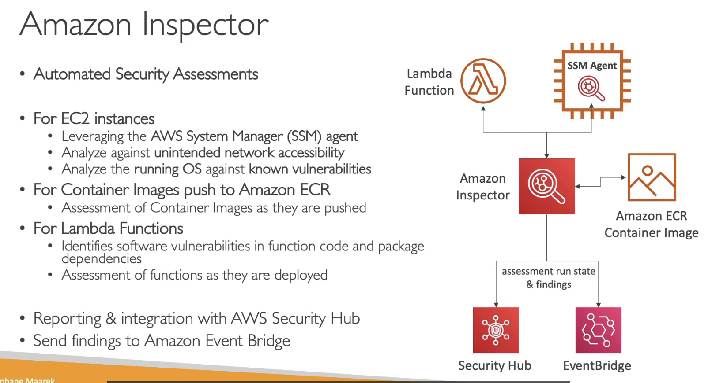
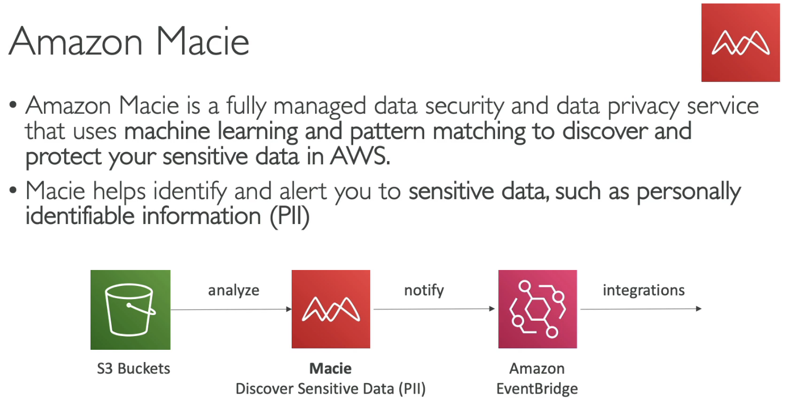
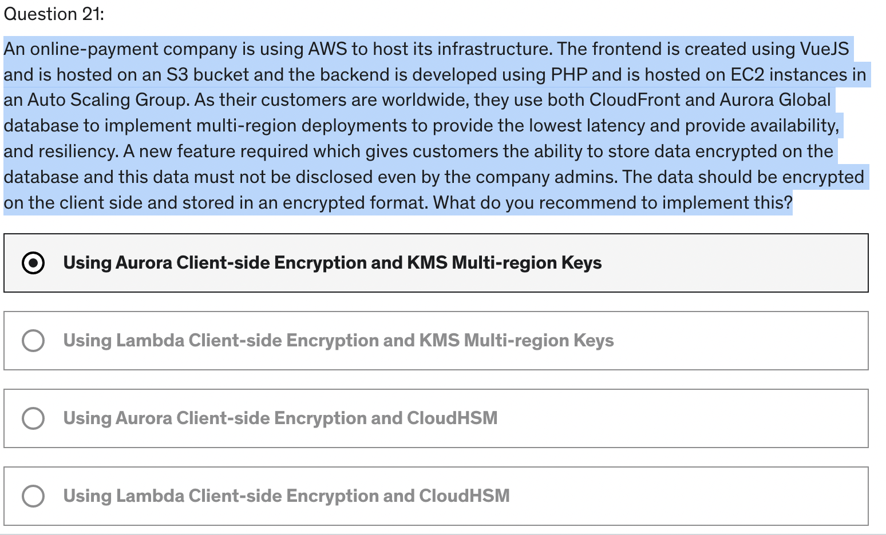

- [Encryption 101](#encryption-101)
- [KMS Overview](#kms-overview)
- [KMS Multi Region Key](#kms-multi-region-key)
- [S3 Replication with Encryption](#s3-replication-with-encryption)
- [Ecnrypted AMI Sharing Process](#ecnrypted-ami-sharing-process)
- [SSM Parameter Store](#ssm-parameter-store)
- [AWS Secret Manager](#aws-secret-manager)
- [AWS Certificate Manager (ACM)](#aws-certificate-manager-acm)
- [Web Application Firewall (WAF)](#web-application-firewall-waf)
- [Shield](#shield)
- [Firewall Manager](#firewall-manager)
- [Best Practices for DDoS Resiliency](#best-practices-for-ddos-resiliency)
- [Amazon GuardDuty](#amazon-guardduty)
- [Amazon Inspector](#amazon-inspector)
- [Amazon Macie](#amazon-macie)
- [Quiz](#quiz)

# Encryption 101
- Encryption in flight (SSL)
  - data -> encrypt -> send -> decrypt
  - SSL certificates
  - ensure NO MITM (Man in the middle attack) can happen
  -   

- Server side encryption at rest
  -   

- Client side encryption
  - exam:** Envelop Encryption**
  - Server never decrypt the data
  -   

# KMS Overview
- Key Management Service
  -   

- KMS Keys Types:
  - Symmetric (AES-256 keys)
  - Asymmetric (RSA & ECC key pairs)
  -  

- AWS KMS (Key Management Service)
  -   

- Copy Snapshots across regions
  - 1 KMS key can NOT live in 2 regions
  - So AWS will **ReEncrypt** (decrypt with key A and ecrypt with key B) with another key when copying snapshot to another region.
  -   

- KMS Key Policies
  - 2 types: Default and Custom
  -   

- Copy Snapshots across accounts
  - Use Key Policy to allow other accounts use the key
  -   

- Hands on
  - Creation:
    - type: symmetric / asymmetric
    - key usage: encrypt & decrypt / generate and verify MAC (sym) / sign and verify (asym)
    - Choose origin: KMS, External (import key), CloudHSM key store, external key store
    - Regionality: **single / multi region**
    - add alias
    -   
    - Choose admin to **manage**: user/role in AWS
    -   
    - Choose subject to **use** key: user / role in AWS / other accounts
    -   
    - 

        
Example of Key policy

        <pre>
            {
                "Id": "key-consolepolicy-3",
                "Version": "2012-10-17",
                "Statement": [
                    {
                        "Sid": "Enable IAM User Permissions",
                        "Effect": "Allow",
                        "Principal": {
                            "AWS": "arn:aws:iam::285098869255:root"
                        },
                        "Action": "kms:*",
                        "Resource": "*"
                    },
                    {
                        "Sid": "Allow access for Key Administrators",
                        "Effect": "Allow",
                        "Principal": {
                            "AWS": [
                                "arn:aws:iam::285098869255:user/van1",
                                "arn:aws:iam::285098869255:role/aws-service-role/ecs.amazonaws.com/AWSServiceRoleForECS"
                            ]
                        },
                        "Action": [
                            "kms:Create*",
                            "kms:Describe*",
                            "kms:Enable*",
                            "kms:List*",
                            "kms:Put*",
                            "kms:Update*",
                            "kms:Revoke*",
                            "kms:Disable*",
                            "kms:Get*",
                            "kms:Delete*",
                            "kms:TagResource",
                            "kms:UntagResource",
                            "kms:ScheduleKeyDeletion",
                            "kms:CancelKeyDeletion"
                        ],
                        "Resource": "*"
                    },
                    {
                        "Sid": "Allow use of the key",
                        "Effect": "Allow",
                        "Principal": {
                            "AWS": [
                                "arn:aws:iam::285098869255:user/van1",
                                "arn:aws:iam::285098869255:role/aws-service-role/ecs.amazonaws.com/AWSServiceRoleForECS",
                                "arn:aws:iam::285098869255:role/aws-service-role/organizations.amazonaws.com/AWSServiceRoleForOrganizations",
                                "arn:aws:iam::285098869255:role/aws-service-role/support.amazonaws.com/AWSServiceRoleForSupport",
                                "arn:aws:iam::285098869255:root"
                            ]
                        },
                        "Action": [
                            "kms:Encrypt",
                            "kms:Decrypt",
                            "kms:ReEncrypt*",
                            "kms:GenerateDataKey*",
                            "kms:DescribeKey"
                        ],
                        "Resource": "*"
                    },
                    {
                        "Sid": "Allow attachment of persistent resources",
                        "Effect": "Allow",
                        "Principal": {
                            "AWS": [
                                "arn:aws:iam::285098869255:user/van1",
                                "arn:aws:iam::285098869255:role/aws-service-role/ecs.amazonaws.com/AWSServiceRoleForECS",
                                "arn:aws:iam::285098869255:role/aws-service-role/organizations.amazonaws.com/AWSServiceRoleForOrganizations",
                                "arn:aws:iam::285098869255:role/aws-service-role/support.amazonaws.com/AWSServiceRoleForSupport",
                                "arn:aws:iam::285098869255:root"
                            ]
                        },
                        "Action": [
                            "kms:CreateGrant",
                            "kms:ListGrants",
                            "kms:RevokeGrant"
                        ],
                        "Resource": "*",
                        "Condition": {
                            "Bool": {
                                "kms:GrantIsForAWSResource": "true"
                            }
                        }
                    }
                ]
            }
        </pre>
    

# KMS Multi Region Key
- Same id
  -   
- NOT global, independently managed, NO need to re-encrypt
- NOT recommended, except some special cases
- Use cases: global client-side encryption, encryption on Global DynamoDB, Global Aurora
-   

- DynamoDB Global Tables
  - encrypt only 1 or some attributes, not all
  -   

- Global Aurora
  - encrypt specific attributes
  -   

# S3 Replication with Encryption
  - if use KMS, need to enbale the option to encrypt S3 objects
  - encrypted objects in bucket A ---key A decrypt---> raw objects -----key B encrypt-----> in bucket B
  - -> Need to has policy 
    - kms:Dycrypt with key A
    - kms:Encrypt with key B
  -   

# Ecnrypted AMI Sharing Process
- AMI: Amazon Machine Images
- How to share image to another account?
  - add `Launch Permission` to the target account
  - Must share KMS keys to the the target account/IAM Role
  -   

# SSM Parameter Store
- Overview
  - SSM (Systems Manager)
  - Parameter Store is 1 of sub-service in SSM
  - for Secrets and configuration data management
  -   
- Store Hierarchy
  -   
- Price
  -   
- Parameters Policies
  -   

- Hands on
  -   
  - Can create SecureString with KMS key of my account or another account
  - Version, History, Tags
  - cmd: `aws ssm get-parameters-by-path help` to help
  - option `--with-decryption` to decrypt string

- Hands on with Lambda
  - python
  - import boto3 to get parameters
  - create inline policy for lambda function 
    - Action `get param with path` with Service **System Manager**
    - Action `Decrypt` with Service **KMS** to decrypt the params
    - (remember to specify the Resource key (param path, KMS key))
  - Trick: Can use Lambda environment variable to choose prod or dev 
    - use this variable in the code

# AWS Secret Manager
- Newer service -> store secrets
  - capability to force **rotation of secrets** every X days
  -   
- Multi-Region Secret
  -   
- Hands on
  - Rotate, manage, retrieve
  - Pricing: 30-day free trial, 0.4$/secret/month, $0.05/10k API calls
  -   
  - Types: 
    - for RDS - username, password
    - for DocumentDB
    - for RedShift
    - for other database
    - other type (can edit by key-value or plaintext)
  - can set permissions and replication and encryption
  - rotation:
    - option 1: automatic by days/hours,... or schedule expression
    - option 2: Use lambda function

# AWS Certificate Manager (ACM)
- Overview
  - Intergrate with LB, Cloudfront, API Gateway
  - Can NOT user ACM with EC2 (can't be extracted)
  -   
- Requesting Public Certificates
  - automatic renewal
  -   

- Importing Public Certificates
  - NO automatic renewal
  - 2 ways to automatic alert:
    - ACM send daily expiration evente to EventBridge
    - AWS Config has a managed rule to check for expiring certs dang send event to EventBridge
  -   

- Integration with ALB
  -   

- Endpoint Types:
  - Edge-Optimized (default)
  - Regional
  - Private
  -   

- Intergration with API Gateway
  -   

# Web Application Firewall (WAF)
- in Layer 7
- Targets: ALB, Gateway, CloudFront, AppSync GraphQL API, Cognito User Pool
  -   
- Define Rules:
  - Web ACL (Web Access Control List)
  - based on IP set, headers, body, URI, size, geo-match, rate-based rules (DDoS protection)
  - Rule Group - reusable set of rules that you can add to a web ACL
  - 

Web ACL
  

- Fixed IP while using WAF with a LB
  -   

# Shield
- protect fromn DDoS attack
- Type:
  - Standard: Free
  - Advanced: $3000/month/org
-   

# Firewall Manager
- Manage rules in all accounts of an AWS Organization
- All in one policies: WAF, Shield, Security Groups, Network FireWall (VPC Level), Route 53 Firewall
-   
- Compare WAF vs Firewall Manager vs Shield
  - **WAF**: only Web ACL
  - **Firewall Manager**: multi accounts, auto for new resource/user. Contains WAF and Shield
  - **Shield**: on top of AWS WAF, advanced version -> support from Shield Response Team and advanced reporting. Consider Shield Advanced when frequent DDoS attacks
  -   

# Best Practices for DDoS Resiliency
- Edge Location Mitigation (BP1, BP3)
  - Use CloudFront, Global Accelerator, Route 53 
  -   
- Infra layer defense (BP1, BP3, BP6), Auto Scaling (BP7), ELB (BP6)
  -   
- Use WAF and Shield Advanced
  -   
- Reduce attack surface
  -   

# Amazon GuardDuty
- Inteligent Thread discovery to protect your AWS account uses ML, anomaly detection
  -   
- Summary
  -   

# Amazon Inspector
- analyze security of other services
-   
-   

# Amazon Macie
- use ML to discover and protect sensitive data
-   

# Quiz
1. To enable In-flight Encryption (In-Transit Encryption), we need to have ........................
    -   
2. Server-side encryption
   -   
3. In Server-Side Encryption, where do the encryption and decryption happen?
   1.   
4. In Client-Side Encryption, the server must know our encryption scheme before we can upload the data?
   1. False. With Client-Side Encryption, the server doesn't need to know any information about the encryption scheme being used, as the server will not perform any encryption or decryption operations.
5. You need to create KMS Keys in AWS KMS before you are able to use the encryption features for EBS, S3, RDS ...
   1. False. You can use the AWS Managed Service keys in KMS, therefore we don't need to create our own KMS keys.
6. AWS KMS supports both symmetric and asymmetric KMS keys.
   1. True. KMS keys can be symmetric or asymmetric. A symmetric KMS key represents a 256-bit key used for encryption and decryption. An asymmetric KMS key represents an RSA key pair used for encryption and decryption or signing and verification, but not both. Or it represents an elliptic curve (ECC) key pair used for signing and verification.
7. When you enable Automatic Rotation on your KMS Key, the backing key is rotated every .................
   1. 1 year
8. You have an AMI that has an encrypted EBS snapshot using KMS CMK. You want to share this AMI with another AWS account. You have shared the AMI with the desired AWS account, but the other AWS account still can't use it. How would you solve this problem?
   1. You need to share the KMS CMK used to encrypt the AMI with the other AWS account
9. You have created a Customer-managed CMK in KMS that you use to encrypt both S3 buckets and EBS snapshots. Your company policy mandates that your encryption keys be rotated every 3 months. What should you do?
   1.    
10. What should you use to control access to your KMS CMKs?
    1.    
11. You have a Lambda function used to process some data in the database. You would like to give your Lambda function access to the database password. Which of the following options is the most secure?
    1.    
12. You have a secret value that you use for encryption purposes, and you want to store and track the values of this secret over time. Which AWS service should you use?
    1.  SSM Parameter Store. SSM Parameters Store can be used to store secrets and has built-in version tracking capability. Each time you edit the value of a parameter, SSM Parameter Store creates a new version of the parameter and retains the previous versions. You can view the details, including the values, of all versions in a parameter's history.
13. Your user-facing website is a high-risk target for DDoS attacks and you would like to get 24/7 support in case they happen and AWS bill reimbursement for the incurred costs during the attack. What AWS service should you use?
    1.  AWS Shield Advanced
14. You would like to externally maintain the configuration values of your main database, to be picked up at runtime by your application. What's the best place to store them to maintain control and version history?
    1.    

15. AWS GuardDuty scans the following data sources, EXCEPT ................
    1.    

16. You have a website hosted on a fleet of EC2 instances fronted by an Application Load Balancer. What should you use to protect your website from common web application attacks (e.g., SQL Injection)?
    1.    

17. You would like to analyze OS vulnerabilities from within EC2 instances. You need these analyses to occur weekly and provide you with concrete recommendations in case vulnerabilities are found. Which AWS service should you use?
    1.  Amazon Inspector. 
18. What is the most suitable AWS service for storing RDS DB passwords which also provides you **automatic rotation**?
    1.    
19. Which AWS service allows you to centrally manage EC2 Security Groups and AWS Shield Advanced across all AWS accounts in your AWS Organization?
    1.  **AWS Firewall Manager** is a security management service that allows you to centrally configure and manage firewall rules across your accounts and applications in AWS Organizations. It is integrated with AWS Organizations so you can enable AWS WAF rules, AWS Shield Advanced protection, security groups, AWS Network Firewall rules, and Amazon Route 53 Resolver DNS Firewall rules.
20. Which AWS service helps you protect your sensitive data stored in S3 buckets?
    1.  **Amazon Macie** is a fully managed data security service that uses Machine Learning to discover and protect your sensitive data stored in S3 buckets. It automatically provides an inventory of S3 buckets including a list of unencrypted buckets, publicly accessible buckets, and buckets shared with other AWS accounts. It allows you to identify and alert you to sensitive data, such as Personally Identifiable Information (PII).
21. An online-payment company is using AWS to host its infrastructure. The frontend is created using VueJS and is hosted on an S3 bucket and the backend is developed using PHP and is hosted on EC2 instances in an Auto Scaling Group. As their customers are worldwide, they use both CloudFront and Aurora Global database to implement multi-region deployments to provide the lowest latency and provide availability, and resiliency. A new feature required which gives customers the ability to store data encrypted on the database and this data must not be disclosed even by the company admins. The data should be encrypted on the client side and stored in an encrypted format. What do you recommend to implement this?
    1.    

22. You have an S3 bucket that is encrypted with SSE-KMS. You have been tasked to replicate the objects to a target bucket in the same AWS region but with a different KMS Key. You have configured the S3 replication, the target bucket, and the target KMS key and it is still not working. What is missing to make the S3 replication work?
    1.    

23. You have generated a public certificate using LetsEncrypt and uploaded it to the ACM so you can use and attach to an Application Load Balancer that forwards traffic to EC2 instances. As this certificate is generated outside of AWS, it does not support the automatic renewal feature. How would you be notified 30 days before this certificate expires so you can manually generate a new one?
    1.    

24. You have created the main Edge-Optimized API Gateway in us-west-2 AWS region. This main Edge-Optimized API Gateway forwards traffic to the second level API Gateway in ap-southeast-1. You want to secure the main API Gateway by attaching an ACM certificate to it. Which AWS region are you going to create the ACM certificate in?
    1.    

25. You are managing an AWS Organization with multiple AWS accounts. Each account has a separate application with different resources. You want an easy way to manage Security Groups and WAF Rules across those accounts as there was a security incident the last week and you want to tighten up your resources. Which AWS service can help you to do so?
    1.  AWS Firewall Manager
    
