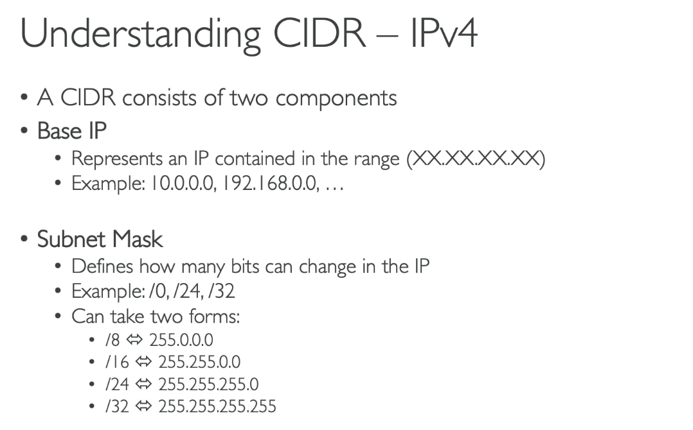
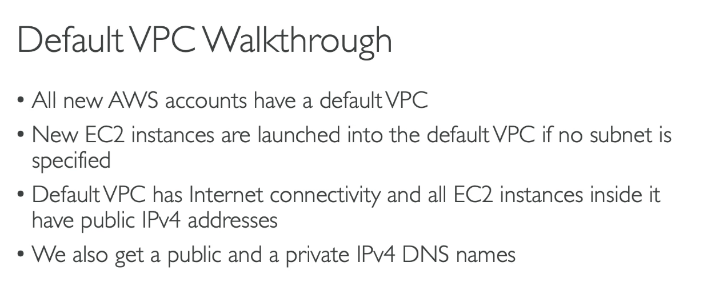
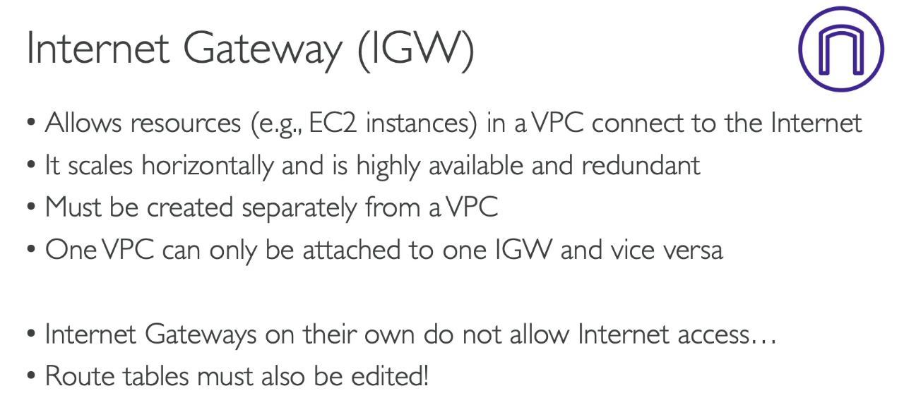
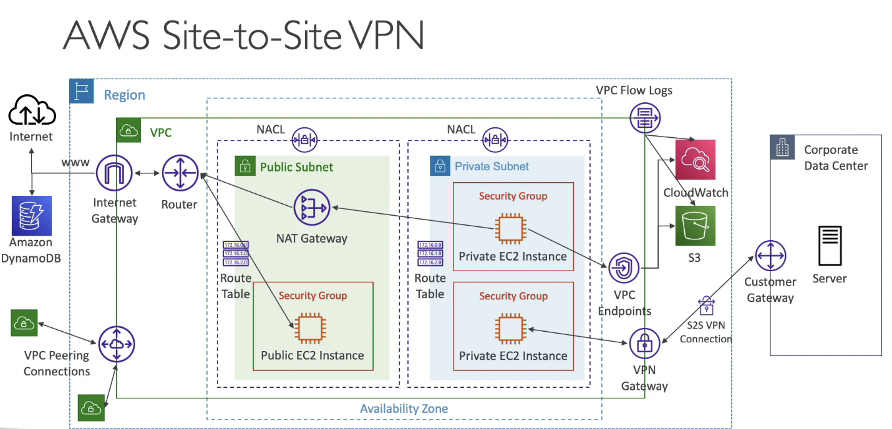
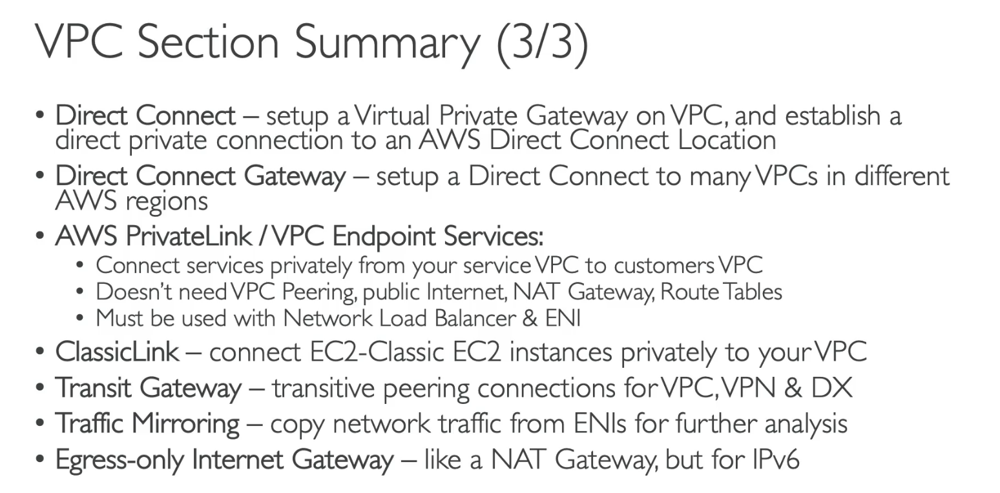

- [VPC Overview](#vpc-overview)
- [CIDR, Private vs Public IP](#cidr-private-vs-public-ip)
- [Deault VPC Oveview](#deault-vpc-oveview)
- [VPC Overview](#vpc-overview-1)
- [Subnet Overview](#subnet-overview)
- [Internet Gateway and Route Tables](#internet-gateway-and-route-tables)
- [Bastion Host](#bastion-host)
- [NAT Instance (Oudated, but still at the exam)](#nat-instance-oudated-but-still-at-the-exam)
- [NAT Gateways](#nat-gateways)
- [NACL and Security Groups](#nacl-and-security-groups)
- [VPC Peering](#vpc-peering)
- [VPC Endpoints](#vpc-endpoints)
- [VPC Flow Logs](#vpc-flow-logs)
- [Site to Site VPN, Virtual Private Gateway and Customer Gateway](#site-to-site-vpn-virtual-private-gateway-and-customer-gateway)
- [Direct Connect (DX)](#direct-connect-dx)
- [Direct Connect + Site to Site VPN](#direct-connect--site-to-site-vpn)
- [Transit Gateway](#transit-gateway)
- [VPC Traffic Mirroring](#vpc-traffic-mirroring)
- [IPv6 for VPC](#ipv6-for-vpc)
- [Egress-only Internet Gateway](#egress-only-internet-gateway)
- [VPC Summary](#vpc-summary)
- [Networking costs **per GB**](#networking-costs-per-gb)
- [AWS Network Firewall](#aws-network-firewall)

# VPC Overview
-   
- take cost: NAT Gateway,..

# CIDR, Private vs Public IP
- CIDR
  - **Classless Inter-Domain Routing**
  -   
  - Components: Base IP and Subnet Mask
  - 
  - Subnet Mask
  -   
  - 192.268.0.0/24 = 192.168.0.255
- Public vs. Private IP (IPv4)
  -   

# Deault VPC Oveview
-   
- 1 subnet -> 1 availability zone
- has route tables, subnets,...

# VPC Overview
- VPC = Virtual Private Cloud
-   
- Hands on
  - Create VPC 
    - IPv4 CIDR block
    - IPv6 -> Optional

# Subnet Overview
-   
- VPC Subnet IPv4
  - 5 IP in range can bot used for EC2
  -   

# Internet Gateway and Route Tables
- Internet Gateway (IGW)
  - 
  -   
- Hands on:
  - Create VPC, create subnets
  - Edit a subnet, set auto assign public IP
  - Create an EC2 instance:
    - Choose VPC
    - Choose subnet
    - Enable ssh 
  - Try to ssh to the EC2 instance -> fail due to lack of internet connection to the instance
  - -> Create Internet Gateway
    - Choose VPC to attach
  - Try ssh -> fail again
  - -> Create Route Table
    - Choose VPC
    - Attach subnets to the route table in *subnet associations*
    - Edit the route in the public route table
      - any IPs route to IGW   
  - Try to ssh the instance -> ok
  - pin google.com -> ok
  -   

# Bastion Host
- Bridge to ssh to EC2 instances from the Internet
-   
- Hands on:
  - Create new Key Pair and download
  - Create an EC2 instance
    - Choose VPC, choose private subnet
    - Choose key pair
    - Allow ssh from security group of Bastion instance that we created (can access bastion from internet)
  - ssh to the bastion instance
  - copy private ip address of the private instance
  - In Bastion:
    - Create a new .pem file and copy downloaded keypair to it
    - `chmod 0400 DemoKeyPair.pem`
    - `ssh ec2-user@{private-ip} -i DemoKeyPair.pem` -> OK
    - ping google.com -> NOT OK

# NAT Instance (Oudated, but still at the exam)
- NAT = Network Address Translation
- Allows EC2 instances in private subnets to connect to the Internet
-   
-   
- Comments:
  -   
- Hands on
  - Create an EC2 instance
    - Image: ..nat..
    - choose vpc
    - add rule: allow HTTP and HTTPs from private subnet 
    - add 
  - Choose the EC2 instance and click edit network setting
  - Change source/destionation check
    -   
  - Add routes in the private subnet
    - Des: 0.0.0.0/0
    - target: NAT Instance
    - (If go to the internet, go through the NAT instance)
  - Add inbound rules of the NAT Instance
    - Type: All ICMP - IPv4
    - From: private subnet
  - You can ping goole.com from the Private EC2 Instance

# NAT Gateways
-   
-   
- High avilability
  - single AZ
  - -> Multi NATGW in multiple AZs
  -   
- Compare with NAT Instance
  -   
- Hands on:
  - VPC -> NATGateway -> Create
    - Choose subnet
    - Connect type: public/private
    - allocate Elastic IP
  - Edit Route table 
    - 0.0.0.0/0 -> the NAT Gateway
  - ping google.com -> OK

# NACL and Security Groups
-   
- NACL = Network ACL 
  - **Stateless** -> outbound request need to be evaluated
  - control traffic to **subnets**
  - match rules with high score (precedence) first
  -  
  -    
  -  Default NACL:
     -  accept everything in and out
     -    
  - Ephemeral Ports (temp port)
    - clients open temp random ports to recieve responses from servers (servers send to these ports)
    -   
  - NACL with Ephemeral Ports
    -   

  - NACL rules for each target subnets CIDR
    -   

- Security Group
  - **Stateful** -> outbound request DONT need to be avaluated
  - Instance level

- Compare
  -   

# VPC Peering
- can connect 2 VPC (different accounts or regions)
- must not have overlapping CIDRs
- A can not connect to C through B
- must update route tables in subnets
-   
-   
-   
- Hands on:
  - must be accept VPC Peering request (in my account or other account)
  - update route tables of subnets -> EC2 instance can connect to other VPCs

# VPC Endpoints
- default: DynomoDB, CloudWatch, S3 public to the Internet
- Use VPC Endpoint to prevent public -> connect through VPC endpoint
  -   
- Compare
  - Option1: 
    - connect through NAT Gateway -> Internet Gateway
    - a lot of money because of NATGW, IGW 
  -  Option 2:
     -  Use VPC Endpoint 
     -  (using a private network)
     -   

- 2 types of endpoints:
  - Interface Endpoints
    - cost
    - most AWS services
  - Gateway Endpoints:
    - free
    - only S3 and DynamoDB
    - preferred in the exam
  -   
  -   

- Hands on:
  - Create a role for the EC2 instance to have access to S3 (ReadOnly) (this instance can access internet through NATGateway and Internet Gateway)
  - ssh to EC2, run `aws s3 ls` -> ok
  - remove rows in route tables to prevent access to the Internet
  - run again -> NOT ok (can not connect)
  - Create VPC Endpoint from VPC to S3
  - run `aws s3 ls --region eu-central-1` (must be the region when create Endpoint - eu-central-1) -> OK

# VPC Flow Logs
- Overview
  - 3 kinds to capture info: **VPC Flow Logs**, Subnet Flow Logs, ENI Flow Logs
  - can send to S3, CloudWatch Logs, Kinesis Data Firehose
  -   
- Logs Syntax
  -   
- Troubleshoot SG and NACL
  -   
- Arch:
  -   

- Hands on
  - Create VPC Flow Logs
  - choose aggregation interval
  - choose destination: S3, CLoudwatch Logs, Kinesis in my account, Kinesis in another account
  - Default format or custom format
  - Use Athena to analyse logs from s3 (search VPC Flow Logs Athena on google)

# Site to Site VPN, Virtual Private Gateway and Customer Gateway
- connect to the company's Private Network through VPN
  -   
- Site to Site VPN need to things:
  - Virtual Private Gateway (VGW)
  - Customer Gateway
  -   
- Site to Site VPN Connections
  - **Important in the exam**
  -   

- VPN CloudHub
    -   

- Hands on:
  - Create CGW, VGW -> connect by  Site to Site VPN connection

# Direct Connect (DX)
- Direct Connect
  -   
  -   

- Direct Connect Gateway
  - connect more VPC in many regions -> use DXG
  -   
- Direct-Connect - Connection types
  -  If want to transfer some data **within a week** (and want to fast), the answer is not Direct Connect. Because it take about **1 month to establish**
  -    

- Encryption
  -   

- Resiliency
  -   

# Direct Connect + Site to Site VPN
-   

# Transit Gateway
- network topologies can become complicated
  -   

- -> use transit gateway
  - merge them -> star connection
  - IP Multicast -> only Transit Gateway
  -   

- another use case: increase the bandwidth of your site-to-site VPN connection
  - using ECMP (Equal-cost multi-path routing)
  -   
  -   

- Share Direct Connect between multiple accounts
  -   

# VPC Traffic Mirroring
-   

# IPv6 for VPC
-   
-   
- IPv6 Troubleshooting
  - Can NOT launch EC2 instance in your subnet -> no available Ipv4 in the subnet
  - -> Create a new Ipv4 CIDR in the subnet
  -   
- Hands on
  - Edit CIDR of the VPC, add new Ipv6 CIDR
  - Edit subnet's IPv6 CIDR
  - Edit subnet settings, allow auto-assign IPv6 address (always public)
  - Assign new IPv6 for  old ec2 instances
  - Update Security Group, allow SSH from all IPv6

# Egress-only Internet Gateway
- Overview
  - only v6
  - only outbound, not inbound
  - must update route tables
  -   
- Routing
  -   
- Hands on
  - Create 
    - choose vpc
    - edit route table ::/0 -> egress IGW
    - try ping google.com from ec2 instance in private network

# VPC Summary
-   
-   
-   

# Networking costs **per GB**
- Prefer private IP, prefer same AZ
  -   

- minimize egress(outbound) traffic
  -   
 
- S3 Data Transfer Pricing - Analysis for USA
  - Using CloudFront is 7x cheaper than S3 only
  -   

- NATGW vs GW VPC Endpoint
  - prefer VPC Endpoint if using S3
  -   

# AWS Network Firewall
- Network Protection on AWS
  -  
   
- Want to protect in a sophisticated way our entire VPC?
  - -> User AWS Network Firewall
  -   

- Fine Grained Controls
  -   

