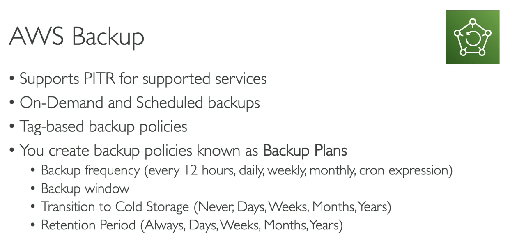

- [Overview](#overview)

# Overview
- very important
- [paper link](../udemy/disaster-recovery-workloads-on-aws.pdf)
- Overview
  -   
- RPO and RTO
  - RPO: Recovery Point Objective - backup point
  - RTO: Recovery Time Objective - recovery point
  - optimize Data Loss and Downtime
  -   
- Disaster Recovery Strategies
  -   
  - Backup and Restore (high RPO)
    - cheap
    - high RPO and RTO: ex: create Snowball to AWS 1 time per week, or create snapshot ~ 24h...
    -   

  - Pilot Light
    - Popular choice
    - ONLY for critical core assistance
    - lower RTO and RPO
    - also cheap (focus on running RDS)
    -   
  - Warm Standby
    - lower RTO and RPO
    - minimum size
    - more expensive (run EC2 and RDS)
    -   
  - Multi Site / Hot Site Approach
    - Very low RTO (minutes or seconds) - very expensive
    - full production size
    -   
  - AWS Multi Region
    -   
- Disaster Recovery Tips
  -   

# Database Migration Service (DMS)
- Overview
  - Note: CDC - Change Data Capture
  - Must create EC2 instance and run DMS on it
  -   
  -   
- SCT
  - ~ Schema Conversion Tool
  -   
- Continuous Replication
  -   
  -   
  - (choose option Multi AZ)

- Hands on:
  - Acccess Service DMS
  - Create Replication instances
    - Name, instance class, engine version, VPC, MultiAZ option, publicly accessible,...
  - Create target and source DB Endpoints
    - engine, server, port, username, password, KMS,...
  - Create Database Migration Tasks
    - Name, choose instance, source and target DB Endpoints, migration type (existing data, existing data and ongoing changes, data changes only), ....

# RDS and Aurora Migrations
-   
-   

# On-Premise strategy with AWS
-   

# AWS Backup
-   
- PITR: Point in time recovery
-   
-   
- Vault Lock
-   

- Hands on
  - Create backup plan
  - Assign Resources (use automatic role or existing IAM role)
    - can specify tags to filter resources
    - 

# Application Migration Service (MGN)
- AWS Application Discovery Service
  -   
- Application Migration Service
  -   

# Transfering Large Datasets into AWS
-   

# VMWare Cloud on AWS
-   

# Quiz

1. As part of your Disaster Recovery plan, you would like to have only the critical infrastructure up and running in AWS. You don't mind a longer Recovery Time Objective (RTO). Which DR strategy do you recommend?
   1.   
2. DR
   1.   
3. Backup and Restore
   1.   
4. Warm StandBy
   1.   
5. Migrate Oracle
   1.   
6. DataSync
   1.   
7. AWS backup
   1.   
8. Application Migration Service
   1.   
9. VMWare
   1.    
10. RDS Migration
    1.    
11. AWS Backup
    1.    

