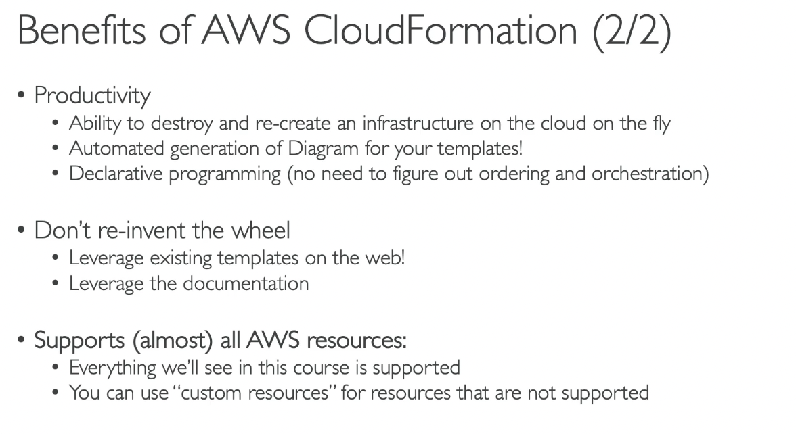

- [CloudFormation](#cloudformation)
- [Amazon SES](#amazon-ses)
- [PinPoint](#pinpoint)
- [SSM Session Manager](#ssm-session-manager)
- [SSM Other Services](#ssm-other-services)
- [Cost Explorer](#cost-explorer)
- [Elastic Transcoder](#elastic-transcoder)
- [AWS Batch](#aws-batch)
- [Amazon AppFlow](#amazon-appflow)

# CloudFormation
- create AWS Infra
  -   
- Benefits
  - Infra as code
    - no resources are manually created
    - infra changes are reviewed through code
  - Cost:
    - Easy to manage cost by tag
    - Estimate costs by template
    - Saving Strategies: can delete/recreate template periodically to save cost 
  - Productivity
    - easy to destroy and create
    - automated generation of Diagram
    - Declarative programming
  - Don't re-invent the wheel
  - Support almost all AWS resources
  -   
  -   
- Stack Deigner
  -   
- Hands on
  - Access CloudFormation
  - Create stack 
    - new template by code /use sample template/create in Designer
    - choose update code (yaml file)
    - choose view in Designer to see the diagram
    - tag
    - IAM role (optional)
    - Estimate the cost
    - Create
  - View events (Create in progress, cretae complete, update, cleanup...)
  - Update template
  - Example
    - [example](../udemy/code/cloudformation/1-ec2-with-sg-eip.yaml)
    -   
  - Delete stack

# Amazon SES
- SES
  - simple email service
  -   

# PinPoint
- Supports email, SMS, push, voice, and in-app messaging
- next evolution of SNS and SES
-   

# SSM Session Manager
- execute commands to EC2 instances through SSM Session Manager (instead of SSH)
-   
- Hands on
  - Create an EC2 instance
    - attach IAM role profile
    -   
  - Access Systems Manager
    - click Fleet Manager to view
    - click Session Manager
    - start a session
    - using secure shell in browser
- 3 ways to connect an Ec2 instance
  - 1 - open port 22 -> ssh
  - 2 - use EC2 Instance Connect (click Connect on EC2 Service) (require port 22)
  - 3 - Use Session Manager (use IAM role, NO port 22 open)

# SSM Other Services
- **Run Command**
  - execute a command/document/script on 1 or multiple instances
  - no need for SSH
  - Output ->logs in S3, CloudWatch
  - send noti to SNS
  - Integrated with IAM and CloudTrail
  - can be invoked using EventBridge
  -   

- **Patch Manager**
  - automate patching managed instances
  - (OS updates, app update, security updates )
  -   

- **Maintainance Windows**
  - Schedule for when perform actions on instances
  -   

- **Automation**
  - ex: restart instances,  create an AMI, EBS snapshots
  - use document to define called `Automation Runbook`
  -   

# Cost Explorer
-   
- By Service
  -   
- By Hourly and Resource
  -   

- Saving Plans
  - recommend saving plans based on our usage
  -   

- Forecast Usage
  -   

# Elastic Transcoder
- convert media files in S3 -> new format in clinet devices
-   

# AWS Batch
- any scale, fully managed
- has start time and end time
- launch  `EC2 instances` or `Spot Instances`
- Batch jobs are defined as **Docker Images** and **run on ECS**
-   
- example
  -   
- Batch vs Lambda
  - Lambda (time limit, serverless, limited runtimes, disk space)
  - Batch (no time limit, any runtime, rely on EBS, and EC2 (not serverless))
  -   

# Amazon AppFlow
- fully managed, securely transfer data between
  - SaaS (Software as a Service) application
  - and AWS
-   
-   