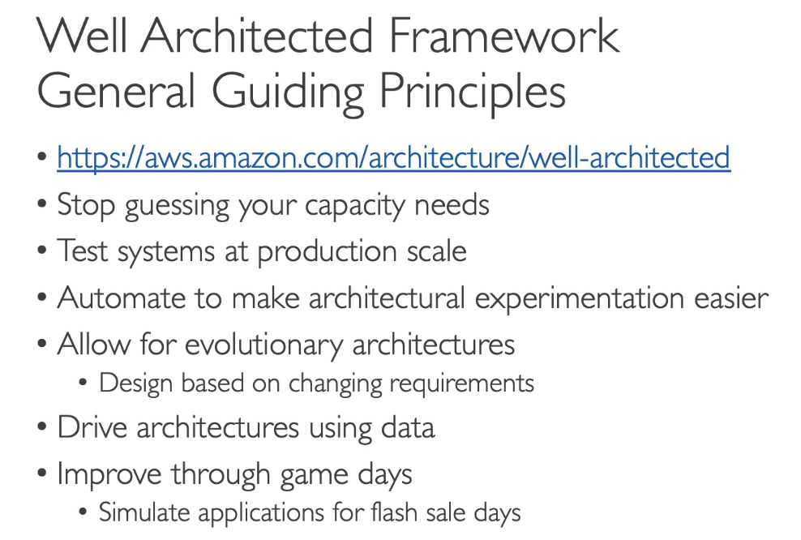
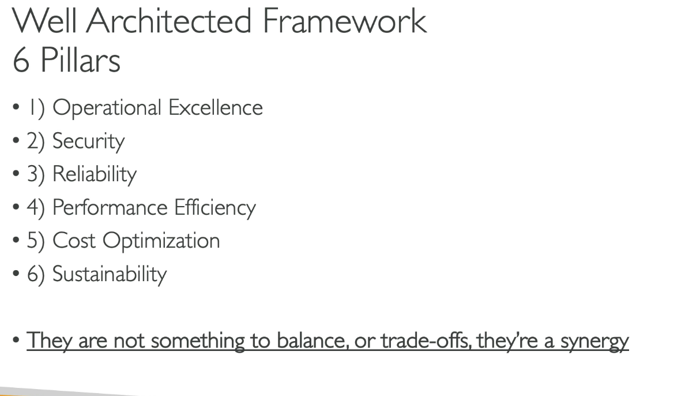
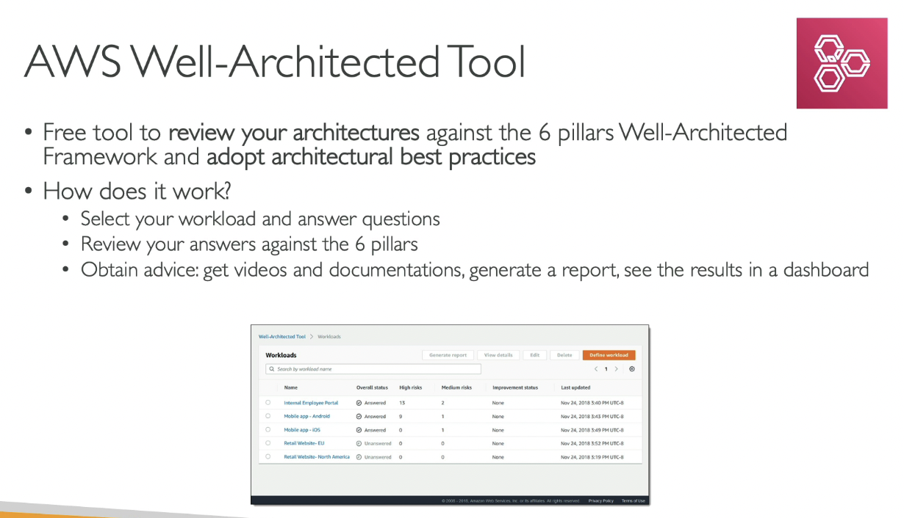
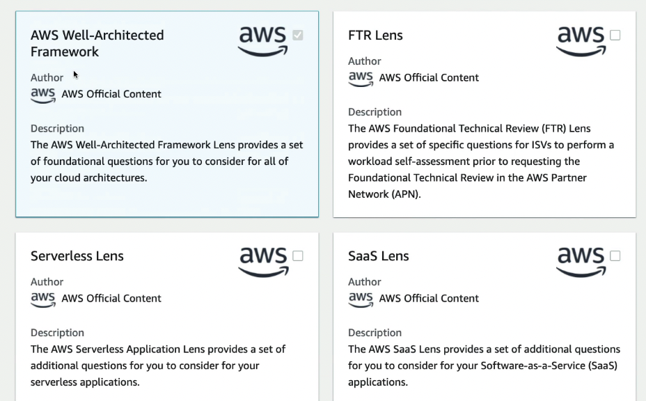
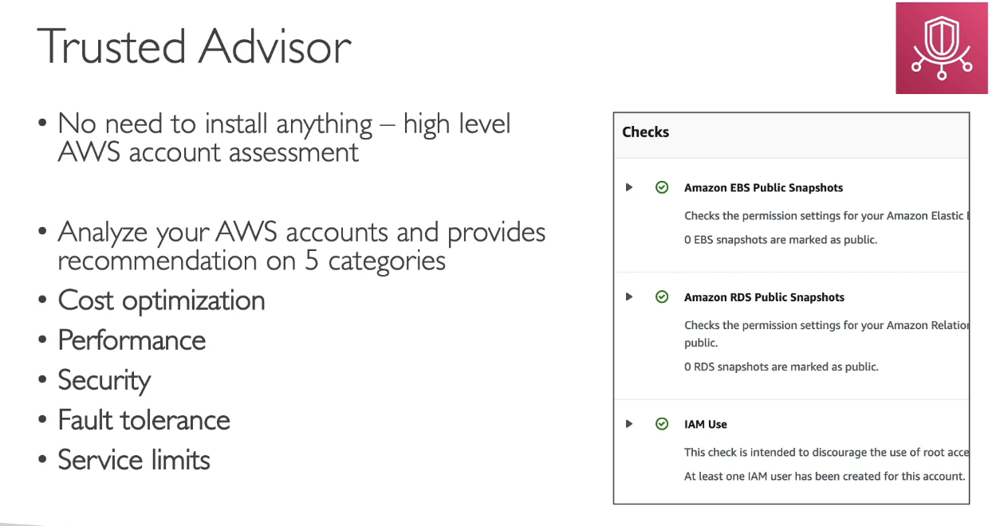
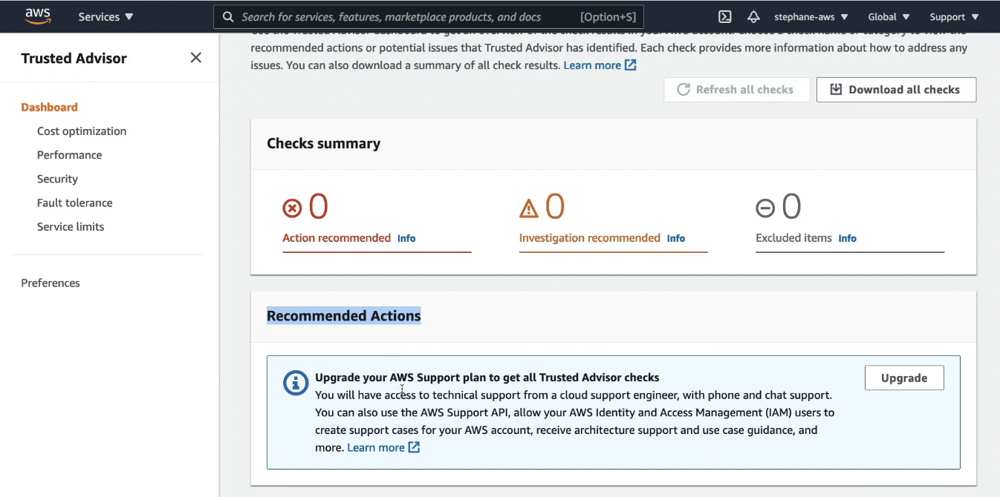

- [Overview](#overview)
- [Well-Architected Framework and Well-Architected Tool](#well-architected-framework-and-well-architected-tool)
- [Trusted Advisor](#trusted-advisor)
- [Examples of Architecture](#examples-of-architecture)
- [Quiz](#quiz)

# Overview
- Well Architected Framework Whitepaper
- Well Architected Tool
- AWS Trusted Advisor
- Reference architectures resources (for real-world)
- Disaster Recovery on AWS Whitepaper

# Well-Architected Framework and Well-Architected Tool
- Framework
  -   
- 6 Pillars
  -   
- Tool
  -   
- Hands on
  - Access Well-Architected Tool
  - Define workload
  - choose prod/dev, regions,...
  - apply lences
    -   
  - Start reviewing
    - anwser a lot of question 
    - view result (high risk, ...)  and receive recommendations
    - review questions

# Trusted Advisor
- Check and analyze account
-   

- Remember 5 categories in the exam
  - Cost Optimization
  - Performance
  - Security
  - Fault tolerance
  - Service limits
- Support Plans
  - **7 CORE CHECKS** -> **Basic** and **Developer** Support Plan (remmeber 7 core checks - 6 in security and 1 in service limits category)
    - S3 Bucket Permission
    - Security Groups - Specific Ports Unrestricted
    - IAM Use (one IAM user minimum)
    - MFA on Root Account
    - EBS public Snapshots
    - RDS Public Snapshots
    - Service Limits: a lot of sub-checks
  - **FULL CHEKCS** - For **Business** And **Enterprise** Support Plan
    - Full Checks available on the 5 categories
    - Ability to set CloudWatch alarms when reaching limits
    - **Programmatic Access** using **AWS Support API**
- Hands on
  -   

# Examples of Architecture
- Examples
  - Patterns
    - **Classic**: EC2, ELB, RDS, ElasticCache,...
    - Serverless: S3, Lambda, DynamoDB, CloudFront, API Gateway, ...
  - Architectures and Solutions Best Practices
    - [https://aws.amazon.com/architecture](https://aws.amazon.com/architecture)
    - [https://aws.amazon.com/solutions](https://aws.amazon.com/solutions)

# Quiz
1. Which AWS Service analyzes your AWS account and gives recommendations for cost optimization, performance, security, fault tolerance, and service limits?
   1. Trusted Advisor (AWS Trusted Advisor provides recommendations that help you follow AWS best practices. It evaluates your account by using checks. These checks identify ways to optimize your AWS infrastructure, improve security and performance, reduce costs, and monitor service quotas.)

