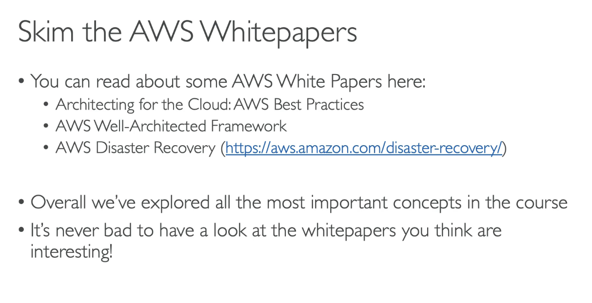
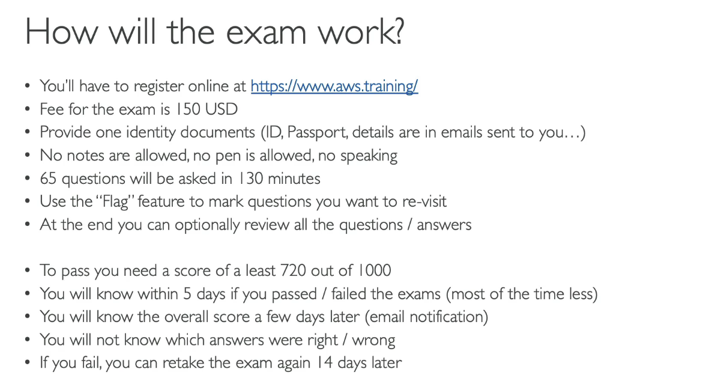

- [State of Learning Checkpoint](#state-of-learning-checkpoint)
- [Exam Tips](#exam-tips)
- [Links to Whitepapers](#links-to-whitepapers)
- [Exam Walkthrough and Signup](#exam-walkthrough-and-signup)
- [Save 50 percent on your Exam Cost](#save-50-percent-on-your-exam-cost)
- [Get Extra 30 Minutes on your AWS Exam](#get-extra-30-minutes-on-your-aws-exam)
- [How does the exam work?](#how-does-the-exam-work)
- [Practice Test 1](#practice-test-1)

# State of Learning Checkpoint
- [https://aws.amazon.com/certification/certified-solutions-architect-associate/](https://aws.amazon.com/certification/certified-solutions-architect-associate/)
- Exam guide
  - 65 questions
    - 50 questions affect your score
    - 15 unscored questions (we dont know about them)
  - Score: 100 -> 1000
  - Minimum pass: 720
  - Domain:
    - 1 Design Secure Architectures 30%
    - 2 Design Resilient Architectures 26%
    - 3 Design High-Performing Architectures 24%
    - 4 Design Cost-Optimized Architectures 20%
- Example questions

# Exam Tips
- Take Practice
- Proceed by elimination
  - remove answer you know for sure are wrong
  - For the remaining answers, understand which one makes the most sense
  - There are very few trick questions
  - Dont over-think it 
  - If a solution seems feasible (can do) but highly complicated, it's probably wrong
  - Use flag feature to review later
- Skim the AWS Whitepapers
  -   
- Read each Service's FAQ
- Join Communities
  - Blogs, forums
  - Groups
  - Youtube Videos

# Links to Whitepapers
1. Architecting for the cloud: https://d1.awsstatic.com/whitepapers/AWS_Cloud_Best_Practices.pdf (Archived)

2. Whitepapers related to well-architected framework are mentioned here: https://aws.amazon.com/blogs/aws/aws-well-architected-framework-updated-white-papers-tools-and-best-practices/

3. Disaster recovery whitepaper: https://d1.awsstatic.com/whitepapers/aws-disaster-recovery.pdf (Archived)

- AWS now recommends a well-architected framework whitepaper: https://d1.awsstatic.com/whitepapers/architecture/AWS_Well-Architected_Framework.pdf

# Exam Walkthrough and Signup
- https://www.aws.training/certification
- Register an exam
- View 50% discount when click Benifits after taking exam
- Online or in test center

# Save 50 percent on your Exam Cost
- If you have taken an exam before

# Get Extra 30 Minutes on your AWS Exam
- Request Accommodations
  - type: ESL + 30 minutes

# How does the exam work?
- 65 questions - 130 minutes
-   

# Practice Test 1
